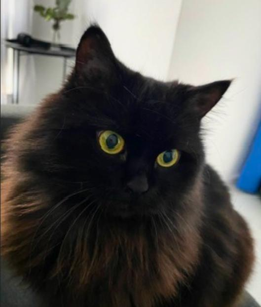

# Варя (Varia)

### Полная медицинская хронология

*Кошка, британская длинношёрстная, кастрирована*

*Период документов: 24.06.2025 – 23.09.2026*

*Отчёт составлен: 08.09.2026; обновлён 24.09.2026*

*Владелец: Karina Grakova*

## Клиническое резюме / текущий статус на 23.09.2026

Одностраничная сводка, чтобы войти в историю за 1–2 минуты. Всё изложенное здесь раскрыто в разделах 1–16, ссылки на разделы даны в скобках. Значком ⚠️ отмечены места, где документы противоречат друг другу или данные отсутствуют.

> **Ситуация на 23.09.2026 — критическая.** Офтальмолог Retina зафиксировал ухудшение роговиц с **кератомаляцией обоих глаз** и рекомендовал срочную операцию (кросслинкинг + ACell Vet + тарзорафия, шанс успеха ~60%; без неё возможна энуклеация). Врач LoVet в тот же вечер оценил общее состояние как плохое: аппетит резко снижен (⚠️ формулировку «1 чайная ложка в день» владелец уточнил как заострённую, см. ниже), сама не пьёт — воду владельцы дают из шприца, гастрит не отвечает на лечение, выпот в грудной клетке нарастает. Проведение операции, по её оценке, возможно только через круглосуточный стационар (в/в обезболивание и противорвотные, дренирование грудной клетки, вероятно назальный зонд); риск высокий; **при сохранении такого состояния в ближайшие дни врач рекомендует рассмотреть эвтаназию** (разд. 4, записи 23.09.2026).

| | |
| --- | --- |
| **Пациент** | Кошка, британская длинношёрстная, кастрирована, чёрная. Дата рождения 25.08.2014, возраст 12 лет; ⚠️ в документах разных клиник встречаются возрастные расхождения (разд. 2). **Вес 4.6 кг на 23.09.2026** — снижение с 4.78 кг 14.09 и 5.2 кг в июле (⚠️ поле «Waga» в бланках LoVet не обновляется, см. разд. 2). |
| **Диагноз** | Высокозлокачественный рак молочной железы. Первичный образец 08.08.2025 — простой солидный рак (*rak prosty lity*), III степень по Mills (разд. 5). |
| **Распространённость** | С 13.04.2026 онколог **клинически** расценивает болезнь как метастатическую с поражением лёгких (TFAST + общая картина). ⚠️ Морфологической верификации лёгочного очага нет. С апреля 2026 — рецидивирующий плевральный выпот. 21.09.2026 на AFAST — новое подкожное образование в области живота 0.46 см, в дифференциальном ряду — рецидив. |
| **Хирургия (4 операции, ALVET)** | 08.08.2025 — тотальная мастэктомия правого ряда + паховый лимфоузел (край ~0.2 мм); 04.11.2025 — узел у рубца, **гистологически доброкачественный**; 29.12.2025 — образование за правой лопаткой, высокая злокачественность + лимфоваскулярная инвазия; 20.03.2026 — образования подмышечной области и живота; низкодифференцированная высокозлокачественная опухоль, опухолевые клетки многоочагово контактируют с гистологическими краями материала (разд. 6). |
| **Химиотерапия** | Карбоплатин 200 мг/м² — одна доза 18.05.2026; введение 08.06.2026 отменено из-за тяжёлой нейтропении (Neu# 0.45). С 15.06.2026 — доксорубицин 1 мг/кг каждые 21 день; введено 5 доз, последняя 07.09.2026. 21.09.2026 шестая доза запланирована «через неделю» (~28.09.2026); после визита 23.09 вопрос фактически открыт (разд. 7). |
| **Таргетная терапия** | Palladia (торцераниб) с 13.04.2026: 10 → 15 → 10 мг пн/ср/пт. Препарат применялся параллельно с первой дозой карбоплатина от 18.05.2026. После выявления тяжёлой нейтропении 08.06.2026 карбоплатин и Palladia были прекращены; с 15.06.2026 начат доксорубицин. По словам владельца, после этого Palladia больше не применялась. |
| **Терапия на 23.09.2026** | **Преднизолон:** 5 мг с 11.09, **снова снижен до 3/4 табл./день 21.09.2026**. **ЖКТ:** сукральфат 1 мл 2×/день; Helicid (омепразол) 20 мг 1/4 капс. 2×/день (⚠️ не указано, заменяет ли он Ranigast/фамотидин от 21.09); Cerenia 1×/день п/к и но-шпа п/к 1–2×/день (с 21.09); 23.09 в клинике нанесён **Mirataz** (трансдермальный миртазапин). **Обезболивание:** Bunondol (бупренорфин) 0.05 мл на слизистую, до эффекта, максимум 0.15 мл, **каждые 8 часов** (было — каждые 12 часов). **Глаза:** Acatavir, Tobrex, **Vigamox** (с 21.09), Vital Drop, Corneregel, Optixcare, сыворотка — строго по порядку с интервалами; бандажная линза в левый глаз переустановлена 21.09, но 23.09 в левом глазу снова не обнаружена. Фуросемид — по потребности (с 13–14.09) (разд. 9, 10). |

#### Активные проблемы на последнюю задокументированную дату

- **Роговица — угроза глазам:** 21.09.2026 — ухудшение с лейкоцитарным инфильтратом и глубокой васкуляризацией, взят посев, добавлен Vigamox; 23.09.2026 — дальнейшее ухудшение, **кератомаляция обоих глаз**, глубокая перилимбальная васкуляризация на 4 мм, преципитаты на эндотелии, гиперемия конъюнктивы, густые зеленоватые выделения; из левого глаза выпала бандажная линза. Поражение больше не ограничено эпителием. Зрительные реакции (menace, dazzle, PLR) пока сохранны. Рекомендована срочная операция (шанс ~60%); без неё возможна энуклеация. Со слов владельцев, первую неделю после установки линз было улучшение, затем — ухудшение после новой партии сыворотки (разд. 10).
- **Резко сниженный аппетит, гастрит, тошнота:** по анамнезу 23.09 — «неделю около 1 чайной ложки корма в день», сама не пьёт (воду владельцы дают из шприца; владелец связывает отказ с болью в глазах). ⚠️ «1 чайная ложка в день» — формулировка владельца, по его уточнению намеренно заострённая, чтобы клиника отреагировала; реальный объём съеденного не измерялся (разд. 4, наблюдение владельца 23.09). После нанесения Mirataz вечером 23.09, со слов владельца, поела и помочилась. 21.09 на AFAST — чёткие признаки гастрита; тошнота не купируется ни Cerenia, ни ондансетроном, ни но-шпой. Вес −4% за 9 дней. Врач 23.09: «не отвечает на лечение воспаления желудка». Тест на панкреатит (fPL) запланирован 21.09, результата нет (разд. 12).
- **Плевральный выпот нарастает:** 21.09 — 1.15 см слева / 0.89 см справа (на высоте сердца), 23.09 — 1.6 см слева / ~2.6 см справа, дыхание учащённое. Последняя фактическая пункция — 06.07.2026. Врач связывает возможное накопление со снижением стероида 21.09 (разд. 4).
- **Обезболивание упирается в дыхание:** бупренорфин по словам владельца действует около часа; врач LoVet указывает, что более высокие дозы опиоидов могут ухудшить дыхание. Стероид, со своей стороны, может сдерживать выпот, но вредит желудку и, по оценке офтальмолога, снижает шанс успеха операции на глазах.
- **Новое подкожное образование в области живота 0.46 см** (AFAST, 21.09.2026) — в дифференциальной диагностике рецидив; не верифицировано.
- **Анемия:** на бланке IDEXX от 14.09.2026 RBC, гематокрит и гемоглобин в пределах референса; сохраняются сниженный MCH и высокий RDW, тромбоцитоз 700 ×10⁹/л (разд. 8). Более свежих бланков нет — «последние анализы без отклонений» в записи 23.09 относятся, вероятно, к 14.09.
- **Образование ~0.9×0.7 см** у верхушки сердца/в средостении с кистой внутри — случайная находка 26.08.2026, природа не установлена (разд. 11).
- **Почки:** изменённые почки с обеих сторон на AFAST 14.09.2026 при нормальной биохимии (креатинин 126 мкмоль/л) (разд. 8.1, 13).
- **Разрастания в пределах стенки грудной клетки** (TFAST, 14.09.2026) — не откомментированы.

#### Что требует решения в первую очередь

1. **Операция на глазах или нет** — и если да, то в каких условиях. Две клиники дали 23.09.2026 позиции, которые нужно свести вместе: офтальмолог — срочная операция, без неё прогноз по глазам от очень осторожного до неблагоприятного; лечащий врач — операция возможна только через круглосуточный стационар, риск высокий, общее состояние после неё может оставаться плохим. Альтернативы, названные в документах: терапия UV-C, энуклеация (более длительный наркоз). Протокол наркоза — см. рукописную записку (разд. 4).
2. **Общая цель лечения.** Лечащий врач 23.09.2026 письменно рекомендует рассмотреть эвтаназию, если состояние в ближайшие дни не изменится. Критерии, по которым оценивать «ближайшие дни», в документе не заданы — их стоит проговорить с врачом явно.
3. **Питание и гидратация:** сама не пьёт, воду владельцы дают из шприца — объём в мл/сутки стоит записывать и сообщить врачу. Аппетит резко снижен около недели; точный объём потребления неизвестен (формулировка «1 чайная ложка» заострена владельцем). Вечером 23.09 после Mirataz кошка поела — стоит зафиксировать, сохраняется ли эффект. Врач упоминает назальный зонд в условиях стационара.
4. **Шестая доза доксорубицина** (~28.09.2026): 21.09 запланирована, после 23.09 её уместность не обсуждалась.
5. **Плевральный выпот:** нужна ли пункция сейчас — 23.09 это названо частью стационарного плана, отдельно не решено.
6. **Доза стероида** — три решения за две недели (5 мг → 3/4 табл. 07.09 → 5 мг 11.09 → 3/4 табл. 21.09) с противоположными последствиями для выпота, желудка и роговицы; риск/польза между клиниками не согласованы.
7. **Подкожное образование 0.46 см** и **разрастания стенки грудной клетки** — вероятные признаки прогрессии, не верифицированы.
8. **Mirataz (миртазапин)** назначен при том, что ранее миртазапин вызывал запор (анамнез 14.09.2026).

Полный перечень открытых вопросов и расхождений между документами — раздел 15.

---

## 1. Как читать этот документ

Этот отчёт составлен владелицей кошки на основе фотографий бумажных и электронных медицинских документов (карты визитов, результаты лабораторных анализов, гистопатологические и цитологические заключения, чеки внутренних лабораторий, рентген-снимки), полученных из нескольких ветеринарных клиник и лабораторий. Документы загружались не по порядку и по частям; настоящий отчёт — результат их сведения в единую, проверенную на противоречия хронологию.

**Документ не заменяет осмотр и заключение ветеринарного врача.** Он предназначен для того, чтобы дать новому врачу, онкологу или любому консультирующему специалисту максимально полную и точную картину истории болезни, не тратя время на разбор десятков разрозненных фотографий.

#### Принципы составления

- **Факты из документов** приводятся со ссылкой на дату и источник; при прямом цитировании оригинала (обычно по-польски) даётся перевод.
- **Слова владельца** (анамнез, наблюдения дома) отдельно помечены как «со слов владельца» — это не объективные клинические данные.
- **Пробелы в данных** обозначены как «не указано», «документ не загружен», «требует подтверждения» — там, где информация отсутствует, ничего не домысливается.
- Значком **⚠️** отмечены расхождения и противоречия между документами — приведены обе версии без попытки самостоятельно решить, какая верна; полный перечень — в разделе 15.
- Величины лабораторных показателей приводятся с единицами измерения и референсным интервалом лаборатории, выполнившей анализ (внутренняя лаборатория LoVet использует иные интервалы, чем IDEXX — сравнивать числа напрямую между этими двумя системами некорректно).
- Непрофессиональные (не врачебные) описания изображений — например, рентген-снимков без приложенного заключения — отдельно помечены и не должны восприниматься как диагноз.

---

## 2. Данные пациента

| Параметр | Значение |
| --- | --- |
| Кличка | VARIA (Варя). В документах клиники Retina встречаются опечатки — «Waria», «Walia». |
| Вид / пол | Кошка, самка, кастрирована (samica kastrowana). |
| Порода | Британская длинношёрстная (kot brytyjski długowłosy) — точно по документам ALVET. LoVet в бланках указывает упрощённо «Kot brytyjski» без указания шёрстности — это не противоречие, а разная детализация в разных клиниках. |
| Окрас | Чёрный (maść czarna). |
| Чип | 968000011873589 |
| Дата рождения | **25.08.2014** — подтверждено владельцем. ⚠️ В документах разных клиник встречаются возрастные расхождения (см. ниже); приоритетная дата для отчёта — 25.08.2014. |
| Владелец | Karina Grakova, ul. Św. Jacka 18e, 30-364 Kraków, тел. 577682296(9)*, email karinagrva@gmail.com / gudvitt@gmail.com. *В разных документах телефон указан с разночтением в последней цифре — не критично, не проверялось. |

#### Обоснование даты рождения

Клиника ALVET указывает возраст в формате «X лет и Y месяцев», что позволяет реконструировать дату рождения по нескольким независимым точкам:

| Дата записи | Возраст в документе | Расчётная дата рождения |
| --- | --- | --- |
| 08.08.2025 | 10 lat i 11 miesięcy | ≈ сентябрь 2014 |
| 29.12.2025 | 11 lat i 4 miesiące | ≈ конец августа 2014 |
| 04.11.2025 | 11 лат и 2 miesiące | ≈ начало сентября 2014 |
| 20.03.2026 | 11 лат и 7 miesięcy | ≈ август 2014 |

Четыре записи ALVET согласуются между собой и указывают на **август–сентябрь 2014 года**.

⚠️ Однако записи клиники Retina дают другую картину:

| Дата записи | Возраст в документе | Расчётная дата рождения |
| --- | --- | --- |
| 18.08.2026 | 12 лет 7 месяцев | ≈ январь 2014 |
| 25.08.2026 | 12 лет 8 месяцев | ≈ декабрь 2013 |
| 10.09.2026 | 12 лет 8 месяцев | ≈ январь 2014 |
| 23.09.2026 | 12 лет 9 месяцев | ≈ декабрь 2013 |

Отдельно на бланке IDEXX от 24.06.2025 возраст указан как «11 R» — это тоже лучше согласуется с более ранней датой рождения, чем с сентябрём 2014 года.

Таким образом, **возрастные данные разных клиник противоречат друг другу**: записи ALVET в целом согласуются с датой рождения 25.08.2014, подтверждённой владельцем, а записи Retina дают более раннюю расчётную дату — примерно декабрь 2013 — январь 2014. На бланке биохимии LoVet от 02.09.2026 указано «9 лет» — явная техническая ошибка, не использовать как источник возраста.

#### Клиники, лаборатории и врачи

| Клиника / лаборатория | Профиль | Врачи |
| --- | --- | --- |
| Przychodnia Weterynaryjna **LoVet** Domagały 45/LU06, 30-741 Kraków тел. 48797831631 | Основной лечащий врач, онкология, химиотерапия | Agata Drewniak (основной лечащий врач/онколог), Oliwia Szaflik, Joanna Żak, Małgorzata Malec, Aldona Gromny |
| **ALVET** Gabinet Weterynaryjny Olga Jaworska ul. G. Zapolskiej 42/12, 30-126 Kraków тел. 501259254, olga.jaworska@wp.pl | Все онкологические операции 2025 – начала 2026 гг. | lek. wet. Olga Jaworska |
| **ALPHAVET** Centrum Małych Zwierząt ul. Lubostroń 15, 30-383 Kraków | Кардиология | Dr n. wet. Paweł Łyp |
| Przychodnia Weterynaryjna **RETINA** ul. Antoniego Szyllinga 3, 30-433 Kraków тел. 696 789 015, biuro@weterynarz-okulista.pl | Офтальмология | dr n. wet. Paweł Stefanowicz (хирург ESE ECVO), lek. wet. Veronika Chybowska |
| Przychodnia Weterynaryjna **Zakrzówek** ul. Twardowskiego 87/5, 30-312 Kraków тел. 790855850 | Анализ мочи 21.09.2026 | lek. wet. Edyta Korczewicz-Delgado |
| **IDEXX Laboratories** (внешняя, через LoVet и напрямую для ALVET); **ALAB Weterynaria** (гистопатология, цитология, общий анализ мочи для ALVET); **Vetlab sp. z o.o.**, ul. Żeliwna 36, 40-599 Katowice, тел. 32 413 06 07 (внешняя, через LoVet — в т.ч. фруктозамин, бланк CBD8215); **внутренняя лаборатория LoVet** («Raport analizy hematologicznej») | Лабораторная диагностика | — |

#### Динамика веса

| Дата | Вес, кг | Примечание |
| --- | --- | --- |
| 29.04.2026 | 4.80 |  |
| 18.05.2026 | 4.80 |  |
| 08.06.2026 | 4.80 |  |
| 13.06.2026 | 4.80 (офиц.) | ⚠️ в этом же документе со слов владельца упомянуто «5,3 кг» — расхождение не объяснено |
| 15.06.2026 | 5.30 |  |
| 23.06.2026 | 5.00 |  |
| 24.06.2026 | 5.00 |  |
| 06.07.2026 | 5.20 |  |
| 10.07.2026 | 5.20 |  |
| 27.07.2026 | не указан |  |
| 03.08.2026 | 5.10 |  |
| 17.08.2026 | 4.94 |  |
| 19.08.2026 | 4.94 |  |
| 26.08.2026 | 5.00 |  |
| 02.09.2026 | 4.81 | исправлено от руки в документе |
| 07.09.2026 | 4.77 |  |
| 11.09.2026 | 4.86 / 4.77 | ⚠️ в анамнезе со слов владельца «4.86 кг сегодня», в поле «Waga» того же документа — 4.77 |
| 14.09.2026 | 4.78 / 4.87 | ⚠️ в описании осмотра 4.78, в поле «Waga» того же документа — 4.87 |
| 21.09.2026 | 4.75 / 4.87 | ⚠️ в описании осмотра 4.75, в поле «Waga» — снова 4.87 |
| 23.09.2026 | 4.6 / 4.87 | ⚠️ в описании осмотра 4.6, в поле «Waga» — снова 4.87; последнее известное значение |

Общая динамика: вес был относительно стабилен (4.8–5.3 кг) на протяжении химиотерапии, с постепенным небольшим снижением к сентябрю 2026 года. В диапазоне 07–14.09.2026 вес колебался в пределах 4.77–4.87 кг. **После 14.09.2026 снижение ускорилось: 4.78 → 4.75 (21.09) → 4.6 кг (23.09)**, то есть около 4% массы тела за 9 дней, на фоне того, что по анамнезу 23.09 кошка неделю съедает около 1 чайной ложки корма в день и не хочет пить (⚠️ формулировка заострена владельцем, реальный объём не измерялся; снижение веса при этом объективно).

⚠️ Поле «Waga» в бланках LoVet содержит **одно и то же значение 4.87 кг в трёх документах подряд** (14.09, 21.09 и 23.09.2026), тогда как в описании осмотра вес каждый раз свой. По всей видимости, это поле не обновляется при каждом визите, поэтому для динамики следует использовать вес из описания осмотра. Это же, вероятно, объясняет расхождения внутри бланков 11.09 и 14.09.

---

## 3. Краткое резюме

**Основной диагноз:** высокозлокачественный рак молочной железы; первичный образец от 08.08.2025 — простой солидный рак, **III степень по Mills**. В ноябре 2025 подозрительный узел оказался **гистологически доброкачественным**. В декабре 2025 подтверждено высокозлокачественное опухолевое поражение правой подмышечной/лопаточной области с **лимфоваскулярной инвазией**, вероятно с поражением лимфоузла; в марте 2026 — два новых высокозлокачественных низкодифференцированных образования с контактом опухолевых клеток с краями резекции. **С 13.04.2026 заболевание клинически расценивается онкологом как метастатическое с поражением лёгких.** С апреля 2026 — рецидивирующий плевральный выпот и пролиферативные изменения стенки грудной клетки.

**Гистологический подтип:** первичная опухоль (08.08.2025) и материал от 29.12.2025 морфологически классифицированы как **простой солидный рак** (*rak prosty lity*). Однако в образцах от операции 20.03.2026 опухоль была настолько низкодифференцированной, что патолог не смог окончательно определить её происхождение только по стандартной гистологии; для разграничения карциномы, саркомы и карциносаркомы было рекомендовано **ИГХ-исследование** (панцитокератин, виментин). По имеющимся документам выполнение ИГХ не подтверждено.

**Текущая терапия (на 23.09.2026):** химиотерапия доксорубицином — введено V доз, последняя 07.09.2026, интервалы строго по 21 дню; 21.09.2026 шестая доза запланирована «через неделю» (~28.09.2026), но после визита 23.09.2026, на котором лечащий врач оценила состояние как плохое и рекомендовала при отсутствии изменений рассмотреть эвтаназию, этот план фактически под вопросом. Ранее — **одна документированная доза карбоплатина** (18.05.2026), на фоне которой продолжалась Palladia; запланированное следующее введение карбоплатина 08.06.2026 отменено/отложено из-за тяжёлой нейтропении, после чего, по словам владельца, были прекращены и карбоплатин, и Palladia; с 15.06.2026 начат доксорубицин. На 23.09.2026: преднизолон **3/4 табл./день** (снижен 21.09 после возврата к 5 мг 11.09); фуросемид по потребности (с 13–14.09); бупренорфин на слизистую **каждые 8 часов** до эффекта; противорвотные (Cerenia п/к), но-шпа п/к, сукральфат, омепразол (Helicid); трансдермальный миртазапин (Mirataz) нанесён 23.09; офтальмологическая схема из 7 препаратов с интервалами, с 21.09 — с Vigamox.

**Сопутствующие проблемы:**

- Почки: азотемия документирована минимум с 20.12.2025 (креатинин 221 мкмоль/л), несколько эпизодов повышения и нормализации креатинина; с 24.06.2026 — неровная капсула левой почки на УЗИ; 10.07.2026 — рентгенопозитивные структуры в почках/мочевом пузыре (не подтверждены дальнейшими исследованиями); **14.09.2026 — на УЗИ изменены обе почки (неровный контур)** при биохимии в пределах нормы (креатинин 126 мкмоль/л).
- Глаза: с середины августа 2026 — тяжёлый, плохо поддающийся лечению двусторонний дефект эпителия роговицы (синдром сухого глаза), возможно связанный с системной терапией и/или носительством FHV1. **10.09.2026 — ухудшение несмотря на интенсивное лечение**: установлены бандажные контактные линзы на оба глаза, добавлен противовирусный Acatavir; с 14.09 — постоянная опиоидная анальгезия «для глаз». **23.09.2026 — дальнейшее ухудшение с кератомаляцией обоих глаз** (поражение распространилось на строму), глубокой васкуляризацией и гнойными по виду выделениями; рекомендована срочная операция (кросслинкинг + ACell Vet + тарзорафия, шанс ~60%), без неё возможна энуклеация.
- ЖКТ: эпизод тяжёлого запора 10.07.2026, потенциально ведущего к мегаколон; исход не задокументирован. С 11.09.2026 — стойко сниженный аппетит, тошнота и дискомфорт; **14.09.2026 на УЗИ — поджелудочная железа пониженной эхогенности и незначительные признаки воспаления желудка**; **21.09.2026 — выраженные УЗИ-признаки гастрита**; к 23.09.2026 — неделю почти не ест и не пьёт, тошнота не купируется, вес 4.6 кг.
- Сердце: случайная находка 26.08.2026 — образование ~0.9×0.7 см у верхушки сердца/в средостении с кистой внутри; признаков ГКМП нет; АД 155 мм рт.ст.; противопоказаний к продолжению химиотерапии кардиолог не выявил.
- Печень: единичное очаговое изменение в паренхиме, впервые описано 24.06.2026; повторно не проверялось.
- Кровь: на 14.09.2026 нейтропении нет, эритроцитарные показатели в пределах референса IDEXX; сохраняются сниженный MCH, высокий RDW, лимфопения и тромбоцитоз 700 ×10⁹/л.

**Наиболее срочные открытые вопросы для нового врача** (полный список — раздел 15):

- **Решение по операции на глазах и по общей цели лечения** — позиции офтальмолога (срочная операция) и лечащего врача (только через круглосуточный стационар, высокий риск, рассмотреть эвтаназию при отсутствии изменений) от 23.09.2026 нужно свести вместе.
- **Новое подкожное образование 0.46 см в области живота** (21.09.2026), в дифференциальном ряду — рецидив.

- Возможность повторного использования Palladia (торцераниба) после курса доксорубицина: препарат ранее применялся параллельно с карбоплатином и, по словам владельца, был прекращён после эпизода тяжёлой нейтропении 08.06.2026; по имеющимся данным нельзя самостоятельно установить, был ли эпизод нейтропении вызван карбоплатином, Palladia или их сочетанием.
- Точный гистологический подтип опухоли не определён (нужна ИГХ).
- Край резекции при последней крупной операции (20.03.2026) гистологически положительный — дальнейшая тактика по документам не описана.
- Плевральный выпот: 21.09 — 1.15/0.89 см, 23.09 — 1.6/~2.6 см (слева/справа) при учащённом дыхании; последняя фактическая пункция — 06.07.2026.
- Шестая доза доксорубицина (~28.09.2026) запланирована 21.09, но после 23.09 её уместность не обсуждалась.
- Рентгенологическая находка в почках/пузыре от 10.07.2026 не была повторно проверена.
- Получены сами рентген-снимки с подписью владельца «02/03/2026» без заключения врача — требуют прочтения радиологом; возможно несоответствие с датой «04.03.2026», ранее известной по другим документам.

---

## 4. Полная хронология по датам

Ниже — все задокументированные события в строгом хронологическом порядке. Результаты лабораторных/гистологических исследований, как правило, приведены сразу под визитом/операцией, к которой они относятся (даже если официальная дата выдачи заключения — позже), чтобы сохранить клиническую связь причины и результата; дата выдачи заключения указана отдельно.

### 2025 год

#### 24.06.2025 — IDEXX: плановый чек-ап + скрининг аллергии (лаб. № LZ405526)

Самый ранний из всех полученных документов — за месяц до обнаружения опухоли. На тот момент признаков онкологического заболевания не зафиксировано.

- Биохимия: креатинин 159.12 мкмоль/л [79.56–203.32] — норма; мочевина 12.14 [5.71–13.57] — верхняя граница нормы; Na 154, K 4.9, общий белок 77, альбумин 36, глобулин 41, A/G 0.88, АЛТ 42, АСТ 35, ЩФ 26, билирубин общий 3.42, холестерин 4.76 — всё в пределах референса.
- Общий анализ крови: эритроциты 9.46, гематокрит 0.415, гемоглобин 128, **MCV 43.9** (для сравнения — нормальный, микроцитоз разовьётся позже), MCH 13.5, MCHC 308, лейкоциты 7.05, тромбоциты 427 — все показатели в норме.
- Скрининг аллергии (GREER, IgE, ингибитор CCD): травы, деревья, клещи/плесень, блохи — все отрицательные.
- Пищевая панель Nutridexx: IgE-антитела — R0 (отрицательно) по всем позициям. IgG-антитела — положительные разной степени (R2–R4) практически ко всем протестированным продуктам (молоко, рыба разных видов, птица, говядина/баранина/свинина, злаки, картофель, соя и др.). Клиническая интерпретация повышенных пищевых IgG у кошек в документе не даётся и в целом неоднозначна в ветеринарии — приведено как объективная находка без интерпретации.

#### 25.07.2025 — обнаружена опухоль на 2-м соске справа

Рентген грудной клетки — без особенностей.

**Цитология ALAB** (заказ №293/25-07-2025 от 25/28.07.2025, материал получен 28.07.2025, исследование выполнено и выдано 01.08.2025 12:44; врач-заказчик lek. wet. Olga Jaworska, патолог prof. dr hab. Rafał Sapierzyński): «Guz sutka kota. 5 rozmazów». Заключение: **«nowotwór nabłonkowy gruczołu sutkowego, z minimalnie wyrażoną złośliwością cytologiczną»** — эпителиальная опухоль молочной железы с минимально выраженной цитологической злокачественностью. Патолог отмечает умеренную корреляцию цитологии и гистологии у кошек и рекомендует хирургическое удаление с гистологией.

#### 06–07.08.2025 — IDEXX: чек-ап перед операцией (лаб. № LZ029307)

- Биохимия: креатинин **150.28 мкмоль/л** [79.56–203.32] — норма (важная точка: последний нормальный креатинин непосредственно перед хирургическим лечением); T4 и SDMA — норма.
- Общий анализ крови: гемоглобин 138, гематокрит 0.386, эритроциты 10.81, тромбоциты 325. **MCV 35.7↓** [39.0–56.0] — здесь впервые виден лёгкий микроцитоз, который сохранится на протяжении всей дальнейшей истории болезни. Ретикулоцитарный гемоглобин 13.4↓ [15.3–22.9] — лаборатория сама пометила результат: **«Result implausibly low. We recommend retesting from new material»** — повторное тестирование по документам не прослеживается.

#### 08.08.2025, 18:22 — ALVET, dr Olga Jaworska: операция №1 — тотальная мастэктомия правого ряда

Тотальная мастэктомия правого ряда молочных желёз с удалением пахового лимфоузла. Среди препаратов визита впервые встречается **Sedatex** (вероятно, седация для премедикации/анестезии; состав и схема по документам не определены).

**Гистология ALAB:** «rak prosty lity o złośliwości III stopnia z wąskim marginesem» — **простой солидный рак, III степень злокачественности по Mills, узкий край резекции**, с очагами некроза; край резекции — порядка 0.2 мм. (Точная польскоязычная формулировка по фотографии документа требует финальной сверки с оригиналом — часть текста мелкая.)

#### 29.10.2025 — обнаружен узел рядом с послеоперационным рубцом внизу живота

Рентген — чисто.

#### 31.10.2025 — IDEXX: анализ крови и биохимия

Креатинин 185.64 [79.56–203.32] — норма, но выше, чем 06.08 (150.28); мочевина 8.57; глюкоза 7.22; **MCV 37.6↓, MCH 12.0↓** — тот же паттерн лёгкого микроцитоза. Остальное в норме.

#### 04.11.2025, 09:49 — ALVET, dr Olga Jaworska: операция №2 — удаление узла у рубца

Со слов владельца: 3–4 дня был более жидкий кал, улучшилось после пробиотика Sustain, накануне визита снова размягчился.

Операция: мастэктомия в правом ряду в области 3 и 4 пары сосков; «guz hyperagresywny wrastający od strony uda licznymi naczyniami z ciemną cieczą» — агрессивно растущая опухоль со стороны бедра с обилием сосудов и тёмной жидкостью внутри; частичное удаление мышц живота; послойное ушивание. Назначено: Биотраксон (цефтриаксон), NaCl, Толфедин; воротник на 10 дней.

**Гистология ALAB (13.11.2025):** «Tkanka tłuszczowa podskórna objęta wieloogniskowym zlewającym się jałowym zapaleniem mieszanym... W badanym materiale brak cech procesu nowotworowego gruczołu sutkowego» — **опухолевого процесса не обнаружено**, изменения оказались доброкачественными (стерильное многоочаговое воспаление жировой ткани, фиброз).

#### 19.12.2025 — обнаружен лимфоузел ~1.5–2 см справа

#### 20.12.2025 — IDEXX: полный анализ крови (лаб. № 1000226201, отчёт создан 20.12.2025 03:16 UTC)

**Креатинин 221 мкмоль/л [79.56–203.32] — выше референса.** Это самый ранний документированный эпизод повышенного креатинина во всей истории болезни. Также **глюкоза 8.33 [3.5–7.77] — выше нормы** (возможно стрессовая гипергликемия).

- Остальная биохимия: мочевина 9.28, Na 153, K 5.0, общий белок 76, альбумин 31, глобулин 45, A/G 0.69, АЛТ 32, АСТ 24, ЩФ 25, билирубин 3.42, холестерин 2.61 — в норме.
- Общий анализ крови: эритроциты 10.62, гематокрит 0.38, гемоглобин 120, **MCV 35.6↓, MCH 11.3↓** (тот же паттерн микроцитоза), MCHC 317, лейкоциты 11.28, тромбоциты 279.

#### 29.12.2025, 17:27 — ALVET, dr Olga Jaworska: операция №3 — опухоль сбоку тела, за правой лопаткой

Рентген грудной клетки, 2 проекции — без видимых изменений в лёгких. Наркоз: дексмедетомидин, метадон, пропофол, изофлуран.

Операция: удаление опухоли «с боку тела, за правой лопаткой» («guz z boku ciała, za łopatką prawą») — **опухоль росла точно между мышцами и прорастала в них**, удалены поражённые мышцы; **опухоль многочастная, чёрно-зелёная, с бороздками**. После операции: биотраксон, толфедин, Рингер в клинике; домой — бунондол; воротник на 10 дней.

*Уточнение анатомии:* гистологический образец обозначен как «tkanki miękkie z pachy kota» (мягкие ткани из подмышечной области), «вероятно изменённый лимфоузел» — то есть локализация в целом согласуется с ранее известным «лимфоузел ~1.5–2 см справа», но документ описывает саму опухоль/поражённые ткани, а не изолированный лимфоузел.

**Гистология ALAB** (заказ № 211/05-01-2026, материал зарегистрирован 07.01.2026, исследование выполнено 12.01.2026, выдано 12.01.2026 19:52): предмет — «Tkanki miękkie z pachy kota». Заключение: **«Rak prosty lity o wysokiej złośliwości histologicznej, prawdopodobnie zmieniony węzeł chłonny, w okolicznych naczyniach limfatycznych skupiska komórek raka»** — простой солидный рак высокой гистологической злокачественности, вероятно изменённый лимфатический узел, в окружающих лимфатических сосудах — скопления опухолевых клеток (**лимфоваскулярная инвазия подтверждена дословно**).

В комментарии патолога (prof. dr hab. Rafał Sapierzyński) приведён общий справочный перечень неблагоприятных прогностических факторов при опухолях молочной железы у кошек (возраст, порода, стадия, диаметр опухоли, степень по Mills, инвазия сосудов, отсутствие рецепторов эстрогена, экспрессия Ki67/COX-2/TP53/TIMP и др.) — **это общая справочная информация лаборатории, а не указание на то, что перечисленные маркеры измерялись непосредственно у Вари.**

### 2026 год

#### 09.02.2026 — контрольный осмотр (первичный документ не загружен)

Рентген чистый; УЗИ всех органов (документация недоступна, известно со слов хирурга: всё выглядело чисто при пробном осмотре). **Возможный небольшой камень в почке и одна почка чуть крупнее другой** — возможно, индивидуальный вариант нормы. Это самое раннее упоминание находок со стороны почек именно на УЗИ (по анализам крови азотемия, как теперь известно, фиксировалась уже 20.12.2025).

#### ~02.02.2026 — начат Neoplazmaxan (со слов сводки от 13.04.2026)

Также кошка получала **Apoquel** (оклацитиниб — ингибитор Janus-киназ (JAK) с противозудным и противоаллергическим действием; европейская регистрация относится к собакам) и была переведена на **почечную диету из-за повышенного креатинина по последнему на тот момент анализу**.

#### 02.03.2026 — тонкоигольная аспирационная биопсия

Результат по сводке 13.04.2026: подозрение на неопластический процесс. Уточнение по первичному документу — **цитология ALAB, исследование от 09.03.2026**: заключение — «рак низкой/умеренной цитологической злокачественности» (более точная формулировка).

#### 02–04.03.2026 — рентген узла (~2 см); во время операции — тёмная жидкость

⚠️ **Получены сами рентген-снимки** (2 файла, боковая и вентродорсальная проекции) с подписью владельца «02/03/2026», тогда как в исходных записях фигурировала дата «04.03.2026» — не ясно, один это документ с опечаткой в дате или два разных исследования; требует уточнения у клиники/владелицы.

На боковой проекции в области живота/паха, каудальнее рёбер, визуализируется крупная структура неоднородной (пятнистой/крапчатой) плотности; на вентродорсальной проекции аналогичная структура видна сбоку от позвоночника в области поясницы/таза. **Это непрофессиональное описание снимка — оценка точной анатомической локализации и клиническое значение находки должны быть подтверждены лечащим врачом/рентгенологом; заключение врача к снимкам не приложено.**

#### 17.03.2026 — IDEXX: анализ крови

**Креатинин 212.16 мкмоль/л — выше референса (79.56–203.32).** Мочевина 13.21 (верхняя граница нормы). Гемоглобин 103.0 (нижняя граница нормы 103.0–162.0).

#### 19.03.2026 — ALAB: общий анализ мочи

**Белок в моче обнаружен (+), гемоглобин резко положителен (++), свежие эритроциты 20–25 в поле зрения** (норма — единичные) — выраженная гематурия и протеинурия. Белок количественно 27.38 мг/дл.

#### 20.03.2026, 12:00 — ALVET, dr Olga Jaworska: операция №4 — опухоли из-под правой подмышки и с живота

Обезболивание ингаляционное изофлураном. Обе опухоли — под мышцами; потребовалось удаление участка мышечной стенки живота и грудной клетки; опухоль под мышкой прилегала к крупным сосудам и нервам подмышечной области, сильно кровоснабжалась, с кровоизлияниями. Врач отметил высокую травматичность операции и риск отёка/пареза правой грудной конечности.

Терапия после операции: марбоцил (марбофлоксацин), толфедин, цепорекс (цефалексин), Рингер с лактатом в/в, бупренорфин, буналгин дома 0.5 табл. каждые 8 ч, воротник на 10 дней.

**Врач ALVET прямо зафиксировал:** «Ogólny wygląd guzów, rozpoznanie HP, liczne już wznowy są spójne w rozpoznanie raka gr mlekowego o wysokiej złośliwości, rokowanie ogólne nie jest pomyślne» — **общий вид опухолей, гистопатологический диагноз и уже многочисленные рецидивы согласуются с диагнозом рака молочной железы высокой степени злокачественности; общий прогноз неблагоприятный.**

**Гистология ALAB (27.03.2026):** «W obu badanych wycinkach nisko zróżnicowany nowotwór o wysokiej złośliwości histologicznej, prawdopodobnie rak lity, wieloogniskowo komórki nowotworowe stykają się z marginesami histologicznymi, w badanym materiale nie stwierdzono naciekania naczyń» — в обоих образцах низкодифференцированная опухоль высокой гистологической злокачественности, вероятно солидный рак; **многоочагово опухолевые клетки контактируют с краями резекции** (край резекции нечистый/сомнительный); признаков сосудистой инвазии не обнаружено. Патолог отдельно отмечает: точное разграничение карцинома/саркома/карциносаркома требует иммуногистохимического окрашивания (панцитокератин, виментин) — **точный гистологический тип опухоли до конца не определён даже документами ALAB.**

#### ~01.04.2026

По состоянию на эту дату, со слов сводки от 13.04.2026: «стабильна, ест и ходит в туалет».

#### 13.04.2026, 16:00 — LoVet, dr Agata Drewniak: первая онкологическая консультация в LoVet

На этом визите составлена англоязычная сводка полного анамнеза с 07.2025 (легла в основу раздела 4 этого отчёта). Осмотр: BCS 4/9, брюшная стенка мягкая, безболезненная, лимфоузлы не увеличены, рубец чистый.

**TFAST:** справа — единичные субплевральные консолидации, до 1.4 мм; слева — небольшое количество свободной жидкости у сердца, изменение 1.4 мм (возможно фиброзированная доля лёгкого), также субплевральные консолидации.

**Заключение врача: распространённая онкологическая болезнь с метастазами в лёгкие** — то есть 13.04.2026 онколог **клинически** расценил заболевание как метастатическое с поражением лёгких на основании TFAST и общей онкологической картины; морфологической верификации лёгочного очага в документах нет. Принято решение начать терапию торцеранибом (**Palladia**) 10 мг, 1 табл. пн/ср/пт, в перчатках, не крошить/не делить, ввиду наличия метастатической болезни. Контроль через 2 недели.

- Гематология (16:31, обр. №5885): WBC 7.33, Neu# 4.18, Lym# 2.73, Mon# 0.05, Eos# 0.37, Bas# 0.00, **RBC 8.03↓, HGB 10.0↓, HCT 28.7↓, MCV 35.8↓**, MCH 12.5, MCHC 35.0, PLT 266.
- Биохимия (23:52): TP 71.0, ALB 32.0, GLO 39.0, TBIL 2.79, AST 21, ALT 43, ALP 40, BUN 9.50, **CRE 202↑** [1–168], CK 88, AMY 1328, **GLU 7.87↑** [3.05–6.1], CHOL 5.12, Ca 2.85, P 1.19.

#### 27.04.2026 — лабораторные бланки (визит-документ не загружен)

- Биохимия: креатинин **161 мкмоль/л** (снизился, в пределах нормы 1–168); K+ 5.23↑; Ca 3.01↑ (верхняя граница); глюкоза 6.73↑.
- Гематология (обр. №6002): WBC 9.94, HGB 11.0, HCT 31.9, MCV 34.9↓, MPV 8.6↓.

Примерно этой же датой (реконструировано по записи Retina от 18.08.2026) начат **преднизолон 5 мг/день** — доза не менялась до 15.06.2026.

#### 29.04.2026, 15:00 — LoVet, dr Agata Drewniak: контрольное УЗИ

Со слов владельца: дыхание во сне 30/мин, чувствует себя хорошо, ест, рвоты/поноса нет.

**УЗИ:** слева значительное улучшение — меньше свободной жидкости; справа свободная жидкость присутствует, но меньше, чем в понедельник; виден небольшой отёк лёгких в добавочных долях; видны субплевральные консолидации.

Назначения: продолжить Palladia 10 мг пн/ср/пт; сохранить стероид 5 мг 1×/день вечером; добавлен **Libeo 10 мг** (фуросемид) — 1/2 табл. утром (= 5 мг фуросемида); контроль через 2 недели. Вес 4.80 кг.

#### До 11.05.2026 — упоминание УЗИ брюшной полости «в феврале 2026»

Со слов владельца, зафиксировано в записи LoVet от 13.06.2026 («USG jamy brzusznej w lutym, ok»). Результат — в норме. Сам документ этого УЗИ не загружен.

#### 11.05.2026, 18:15 — LoVet, dr Agata Drewniak

Пункция грудной клетки (160 мл), прогрессия по УЗИ; введена **Palladia 15 мг** пн/ср/пт; фуросорал 1/4 табл.; Cyklonamina 1/4 табл. 2×/день. Вес 4.80 кг.

#### 18.05.2026, 19:45 — LoVet, dr Agata Drewniak: первая явная химиотерапия

Со слов владельца: поправилась, стала активнее, аппетит в порядке, рвоты и поноса нет. Чешется — хозяева сменили корм. Дыхание на приёме 26–30/мин. УЗИ: количество жидкости сравнимо с количеством после пункции.

**Принято решение ввести Карбоплатин (Carboplatin Ebewe) 200 мг/м² в глюкозе** + Cerenia 0.5 мл в/в — первая явно задокументированная химиотерапия в истории болезни.

Назначения: Cyklonamina 250 мг 1/4 табл. 2×/день; преднизолон — 5 мг 1 табл. 1×/день; Palladia — доза снижена до 10 мг пн/ср/пт, с 25.05.2026; фуросемид снижен до 1/4 табл. 1×/день; при поносе — Carobin Pet Forte; следующая химиотерапия — через 3 недели (ожидалось ~08.06.2026). Вес 4.80 кг.

#### 08.06.2026, 19:30 — LoVet, dr Agata Drewniak: химиотерапия отложена из-за нейтропении

Со слов владельца: 2 недели после химиотерапии — первая неделя слабый аппетит, без рвоты; вторая неделя — лучше. **В анализе крови — тяжёлая нейтропения (WBC 2.56, Neu# 0.45): химиотерапию сегодня ввести нельзя.** УЗИ: слева — меньше свободной жидкости; справа — без изменений.

Решение: химиотерапию перенести на неделю (фактически введена 15.06.2026 — но уже **доксорубицином**, а не карбоплатином, см. раздел 6). Начат антибиотик Veraflox. Куплено, среди прочего, **Palladia 10 мг 20 табл. (3 уп.)**. ⚠️ Это подтверждает покупку препарата 08.06.2026, но не доказывает длительное продолжение приёма после выявления нейтропении: по словам владельца, в этот период были прекращены и карбоплатин, и Palladia. Вес 4.80 кг.

**Гематология (19:58, обр. №6306):** WBC 2.56↓ [5.50–19.50], **Neu# 0.45↓ — тяжёлая нейтропения**, Lym# 1.71, Mon# 0.02↓, Eos# 0.38, RBC 7.85.

#### 13.06.2026 (суббота), 16:30 — LoVet, dr Oliwia Szaflik

Со слов владельца: утром учащённое дыхание ~57/мин в покое (но не во сне); дали 1/2 табл. фуросемида — немного лучше; после консультации по телефону с д-ром Drewniak дали ещё табл. (итого 1.5 табл. за день) — стало лучше, дыхание ~30/мин. Пьёт, мочится. **Вес по словам владельца — 5.3 кг** (⚠️ официальный вес в этом же документе — 4.80 кг). УЗИ брюшной полости в феврале было в норме. Получает преднизолон, veraflox, фуросемид. «Последние результаты хорошие, кроме нейтропении».

Осмотр: слизистые розовые, влажные, CRT<2с. Периферические лимфоузлы **не увеличены**. Тоны сердца в норме, лёгочные шумы ослаблены.

УЗИ: жидкость в грудной клетке с обеих сторон, больше слева; **увеличенные лимфоузлы** (⚠️ иное, чем на осмотре чуть выше — возможно, речь о разных группах узлов). Попытка постановки венфлона — пациентка вырывается, катетер не поставлен.

Назначения: фуросемид 1/2 табл. 1×/день, при учащении дыхания — ещё 1/2 или целую табл.; **за 2 часа до визита — 1 капсула габапентина 100 мг** (впервые формализована цель — седация перед стрессовыми визитами). Официальный вес: 4.80 кг.

**Гематология (16:57, обр. №6359):** WBC 3.53↓, Neu# 1.42↓ (нейтропения), Lym# 1.98, RBC 7.23, HGB 9.9, HCT 26.7, MCV 36.9↓, MCHC 37.2 (флаг H — не согласуется с референсом, но качество термопечати чека затрудняет точное прочтение части значений), RDW-CV 24.2↑, PLT 699↑.

#### ~14.06.2026 (воскресенье) — вероятный визит в дежурную клинику

Реконструировано по записи от 15.06.2026: «W ndz pogorszenie — 3×1,5 Tbl furosoralu — at night 23 — słychać było oddech głośny. Wizyta na dyżurze — 28 ml płynu wolnego». Судя по всему — ухудшение в воскресенье, шумное дыхание ночью, обращение в дежурную клинику, эвакуировано 28 мл жидкости. Сам документ визита не загружен.

#### 15.06.2026, 20:30 — LoVet, dr Agata Drewniak: доксорубицин I (после смены препарата)

Doxorubicin 1 мг/кг = 2.5 мл + маропитант; преднизолон увеличен до 1.5 табл./день (7.5 мг); вес 5.30 кг. ⚠️ На документе есть рукописная дата «18/05», не соответствующая дате визита (эта пометка относится к отдельному визиту 18.05.2026, см. выше).

#### 23.06.2026, 11:15 — LoVet, dr Agata Drewniak: контроль онкологии

TFAST: новые очаги 0.65×0.83, 0.45×0.55, 0.82×0.93 см справа; слева 0.22–0.25 см; глубже — 1.40×1.24 см. Заключение: «стабильная болезнь». Температура 38.30°C, вес 5.00 кг.

#### 24.06.2026, 17:30 — LoVet, dr Oliwia Szaflik

Со слов владельца: слабая со вчерашнего дня, после еды бодрее. Дыхание ~30/мин стабильно.

Осмотр: слизистые розовые влажные. Периферические лимфоузлы **не увеличены** (⚠️ в отличие от записи 13.06.2026). Тоны сердца в норме.

УЗИ: жидкость в грудной клетке с обеих сторон — сходно со вчерашним. В брюшной полости: **единичное очаговое изменение в паренхиме печени (новая находка); левая почка с неровной, «побороздчатой» капсулой (новая находка).** Свободной жидкости в брюшной полости нет. Морфология крови в норме, незначительное снижение гематокрита. **Выраженная липемия — биохимический анализ не выполнен.**

Рекомендации врача: если станет хуже — сделать биохимию для оценки функции почек; **оговорено, что в случае почечной болезни терапевтические возможности ограничены, так как Варя может не перенести внутривенную инфузионную терапию.** Вес 5.00 кг.

#### 06.07.2026, 21:00 — LoVet, dr Agata Drewniak: доксорубицин II

Со слов владельца: утром чувствовала себя хорошо, небольшое количество кала. Последние 2 недели чувствовала себя хорошо, хорошо ела, прибавила в весе.

Осмотр: слизистые бледно-розовые. **Ухудшение дыхания — сделана пункция — эвакуировано 60 мл кровянистой жидкости из грудной клетки** (ранее жидкость не описывалась как кровянистая). На УЗИ — **отёк подкожной клетчатки справа (новая находка).**

Введено: Doxorubicin 1 мг/кг в венфлон + маропитант 1 мг/кг.

⚠️ Документ внутренне противоречив по дозе стероида: в разделе «Zalecenia» написано «steryd bez zmian tj 1,5 Tbl», но чуть ниже — «Prednizolon 5 mg 1 Tbl 1 x dziennie».

Температура 38.50°C, вес 5.20 кг.

**Лабораторные данные (21:30–21:36):** гематология — WBC 9.74 (норма, нейтропения разрешилась), MCV 37.3↓; биохимия — BUN 11.5↑, **K+ 5.19↑**, GLU 6.85↑.

#### 10.07.2026, 13:15 — LoVet, dr Joanna Żak: выраженный запор

Со слов владельца: химиотерапия была в понедельник (06.07.2026). Перед химией — маленькие «горошки» кала. **С понедельника кошка практически не оправлялась.** Получала влажный корм RC Intestinal, Purina Sterilised, лактулозу. Со вчерашнего дня много безуспешных попыток сходить в туалет; во время потуг дважды вырвало.

Осмотр: **подчелюстные лимфоузлы слегка увеличены**, **температура 39.5°C (повышена).** Ректально — каловых масс в пределах достижимости пальца не обнаружено.

**Рентген в боковой проекции: крупные скопления кала в ободочной кишке перед входом в полость таза; кишка расширена — запор, потенциально ведущий к мегаколон. Дополнительно видны более контрастные (рентгенопозитивные) структуры в области почек и в мочевом пузыре** (возможные конкременты/минерализация — не исследовалась и не подтверждалась дополнительно).

Лабораторно — «стрессовая лейкограмма» (нейтрофилия 94.3% при выраженной лимфопении 3.8%); глюкоза 16.47 ммоль/л — значительно выше остальных измерений (вероятно стрессовая гипергликемия); фосфор снижен (0.62, необычно на фоне подозрения на почечную проблему); K+ 5.04↑ (повторно повышен, как и 06.07.2026).

Назначено: продолжить лактулозу 2×/день; **Fiberactiv** (клетчатка); **Dicopeg** (макрогол, слабительное); контроль в понедельник 18:30 (=13.07.2026, документ не загружен). Вес 5.20 кг.

#### 27.07.2026, 16:45 — LoVet, dr Agata Drewniak: доксорубицин III

Doxorubicin 1 мг/кг, 2.5 мл + маропитант. ⚠️ В документе неясная формулировка: «właścicielka włączyła steryd: 3 razy» — не удалось однозначно интерпретировать.

Со слов владельца: фуросемид полностью отменён с 27.07.2026 и после этой даты Варе больше не давался, включая визиты 02.09 и 07.09.2026.

#### 03.08.2026, 16:00 — LoVet, dr Joanna Żak

Осмотр: ухудшение шёрстного покрова — участки поредения/просветления шерсти из-за проступающего подшёрстка. **Опорожнены параанальные железы — левая сильно увеличена, забита.** Введено железо (Suiferrin) 0.3 мл в/м. «Морфология стабильна» по мнению врача (лабораторно, впрочем, присутствуют признаки лёгкой анемии и нейтропении — см. ниже). Выдан Sucralfat — 7 доз по 1 мл. Вес 5.10 кг.

**Гематология (16:14, обр. №6733):** WBC 6.06, **Neu# 1.41↓** (нейтропения), RBC 6.74, **HGB 8.3↓, HCT 23.5↓, MCV 34.9↓** — лёгкая микроцитарная анемия присоединилась к нейтропении.

#### 17.08.2026, 16:45 — LoVet, dr Agata Drewniak: доксорубицин IV, впервые выявлены язвы роговицы

Doxorubicin 1 мг/кг, 2.4 мл + маропитант. Преднизолон снижен до 5 мг/день (1 табл.) — с 27.04 до 15.06.2026 доза была 5 мг/день, с 15.06 повышена до 7.5 мг/день (1.5 табл.), теперь снова снижена до 5 мг.

**Впервые выявлены обширные язвы/эрозии роговицы обоих глаз** (тест на флюоресцеин +++). Начаты Tobrex 6×/день, Yellox 2×/день, Corneregel 3×/день. Рекомендована консультация офтальмолога.

#### 18.08.2026, 14:45 — Retina, dr Paweł Stefanowicz: 1-й визит офтальмолога

Анамнез: кот лечится онкологически, получает доксорубицин. Проблемы с глазами около недели — слезотечение (со слов владельца — начало ~09.08.2026), давали Veraflox.

Осмотр: ВГД OD 18.3, OS 20 мм рт.ст. Скудные слизистые выделения в углу век с обеих сторон. Увлажнение конъюнктивы и роговицы нарушено (низкий мениск слёзной плёнки, короткий NIBUT). Роговица: обширные изменения эндотелия (мацерация, «морщинистость»), видна абразия эпителия роговицы с обеих сторон. Хрусталик — возрастные изменения (склероз ядра). Глазное дно без особенностей.

**Диагноз: поверхностное повреждение роговицы (абразия эпителия). Синдром сухого глаза (ZSO).** Возможные причины: общее состояние, возраст, применяемые препараты (в т.ч. кортикостероиды, химиотерапия), возможное носительство вируса герпеса кошек FHV1 (типично для породы) на фоне снижения иммунитета.

Рекомендации (дословно — «на рассмотрение лечащего врача»): снижение дозы кортикостероида, «разумеется, если позволяет общее состояние»; введение иммуномодулятора, например бета-глюкана. Назначения: Tobrex 4×/день, Corneregel 2–4×/день, Optixcare минимум 4×/день — **«препараты в этой последовательности и с интервалом не менее 2 минут»**. Выдан Optixcare Eye Lube Plus 20 г. Контроль в течение 14 дней или без промедления при тревожных симптомах. Возраст указан: 12 лет 7 месяцев.

⚠️ Требование выдерживать интервалы между каплями, таким образом, содержится **уже в первой записи офтальмолога** и повторяется на каждом следующем визите (25.08 — 2, 5–10 и 15 минут; 03.09 — 2, 5–10 и 10 минут). Прежняя формулировка отчёта о том, что интервалы впервые были прописаны 10.09.2026, была ошибочной и исправлена 24.09.2026 по полному тексту документов.

#### 19.08.2026, 17:00 — LoVet, dr Agata Drewniak

Куплено: Famogast/Ranigast (фамотидин) 20 мг; **Varenzin 23.3 мг/мл, 27 мл** — 1 мл 1×/день в ротовую полость. Varenzin (действующее вещество — **молидустат**) — антианемический препарат, повышающий продукцию эндогенного эритропоэтина; зарегистрирован для лечения нерегенеративной анемии, связанной с хронической болезнью почек у кошек. Конкретное обоснование назначения Варе в записи врача отдельно не сформулировано. Вес 4.94 кг.

#### 25.08.2026, 11:42 — Retina, lek. wet. Veronika Chybowska: 2-й визит офтальмолога

Анамнез: выделения из глаз прекратились, но кошка очень сильно щурится и выглядит очень болезненной. Ест, пьёт, физиологические отправления в норме. Преднизолон снижен до 5 мг с 17.08. Введён бета-глюкан. **Кошка пытается стереть Optixcare и гель Dexoftyal.**

Осмотр (оба глаза описаны одинаково): прищуривание. ВГД OD 19, OS 19 мм рт.ст. Скудные слизистые выделения в углу век — **на контроле улучшение**. Веки в норме. Увлажнение конъюнктивы и роговицы нарушено (низкий мениск, короткий NIBUT) — **улучшение по сравнению с первым осмотром**. Конъюнктива в норме. Роговица: обширные изменения эндотелия (мацерация, «морщинистость»); видна абразия эпителия роговицы — горизонтальная, с неровными краями. Хрусталик — возрастной склероз ядра, глазное дно без отклонений; нейроофтальмологические реакции сохранны.

**Заключение: поверхностные повреждения роговиц (абразия эпителия). Симптомы указывают на нарушение увлажнения роговицы — ZSO. «Интенсифицируем лечение».** Возможные причины — те же, что 18.08.

Назначения — в указанной последовательности: Optixcare EMS 1 капля 1×/день (хранить в холодильнике, **10 минут перерыва** перед следующими препаратами) → 2 мин → Tobrex 4×/день → 2 мин → Corneregel 2×/день → 5–10 мин → Optixcare минимум 4×/день → **15 минут перерыва** перед сывороткой → аллогенная сыворотка/плазма с ЭДТА 4×/день (хранить в холодильнике, согреть в ладони перед закапыванием). Выданы EMS (Eye Support), флакон для сыворотки, Tobrex. Контроль в течение 10 дней. Возраст указан: 12 лет 8 месяцев.

⚠️ **Исправление 24.09.2026.** Ранее в отчёте этому визиту приписывались дефект эпителия OD ~70% / OS ~80%, вывод «ухудшение несмотря на интенсивное лечение» и просьба заменить стероид. По полному тексту документа это **неверно**: процентов площади и вывода об ухудшении 25.08 нет, наоборот, отмечено улучшение по выделениям и увлажнению. Все три пункта относятся к визиту **03.09.2026** (см. ниже).

#### 26.08.2026, 18:36 — ALPHAVET, Dr Paweł Łyp: кардиологическая консультация

ЭхоКГ без признаков ГКМП; **случайно найдено образование ~0.9×0.7 см у верхушки сердца/в средостении с кистой внутри.** АД 155 мм рт.ст. Противопоказаний к продолжению химиотерапии не выявлено.

#### 02.09.2026, 13:15–13:20 — LoVet, dr Małgorzata Malec

**Новый симптом: болезненность при пальпации грудного отдела позвоночника.** УЗИ: слева 0.8 см, справа 0.53 см свободной жидкости. Вес 4.81 кг.

Биохимия: все почечные и печёночные показатели (мочевина, креатинин 120, AST, ALT, ALP, билирубин) — **в пределах нормы**, несмотря на находку изменённой капсулы левой почки на УЗИ от 24.06.2026. Глюкоза 6.93↑ (возможно стрессовая). ⚠️ На бланке ошибочно указан возраст «9 Lat».

IDEXX Haematology — получена только страница 1 из 2; страница 2 (с графиками и комментариями лаборатории) для этой даты так и не была получена.

#### 03.09.2026, 13:58 — Retina, lek. wet. Veronika Chybowska: 3-й визит офтальмолога

Анамнез: немного лучше, но по-прежнему щурится и болезненна. Optixcare каждые 2 часа приносит облегчение. Кошка ест, пьёт, но неактивна. ⚠️ Со слов владельца — «вчера были сделаны анализы крови (в норме), онкологически-терапевтический визит, а также визит к кардиологу — без отклонений»; независимого документа о кардиологическом визите именно 02.09.2026 нет (ближайший задокументированный — 26.08.2026).

Осмотр: прищуривание. ВГД OD 19, OS 19 мм рт.ст. Скудные слизистые выделения — на контроле улучшение. Увлажнение нарушено (низкий мениск, короткий NIBUT). Конъюнктива в норме. Роговица: обширные изменения эндотелия; **дефект эпителия OD ~70%, OS ~80% поверхности — прежние отдельные дефекты слились в один обширный.** Нейроофтальмологические реакции сохранны.

**Заключение: обширные поверхностные повреждения роговиц — дефекты эпителия. Ухудшение несмотря на интенсивное лечение — бóльшие площади дефекта эпителия.** Причина — ZSO; возможные причины те же. Владельцы сообщают, что у лечащего онколога есть возможность заменить пероральный стероид другим препаратом; **«если замена безопасна для общего состояния кошки, прошу заменить препарат»**.

Назначения — в указанной последовательности: Tobrex 4×/день → 2 мин → **Vital Drop 3×/день** (внимание: может щипать — попробовать на одном глазу; при дискомфорте отменить и взять Optixcare EMS 1×/день первым в очереди) → 5–10 мин → Corneregel 2×/день → 5–10 мин → Optixcare минимум 5–6×/день → 10 мин перерыва → сыворотка 4×/день (в холодильнике). Выданы Vital Drop, Tobrex, Optixcare Eye Lube Plus, флакон для сыворотки. Контроль в течение 7 дней. Возраст указан: 12 лет 8 месяцев.

Это **первая** запись с числовой оценкой площади дефекта.

#### 07.09.2026, 18:00 — LoVet, dr Agata Drewniak: доксорубицин V (последняя известная доза)

Со слов владельца — «были 3 раза в Retinie» (подтверждается тремя визитами 18.08, 25.08, 03.09.2026). **Varenzin отменён; стероид снижен до 3/4 табл./день.**

**УЗИ по письменной записи: слева 2.0 см, справа 1.5 см свободной жидкости.** ⚠️ Оценка динамики плеврального выпота между 02.09 и 07.09.2026 неоднозначна. В письменной записи 02.09 указано 0.8 см слева и 0.53 см справа, а 07.09 — 2.0 см слева и 1.5 см справа. Однако во время осмотра 07.09 dr Agata Drewniak устно сообщила владельцам, что количество жидкости находится примерно на том же уровне, что и ранее. Поэтому на основании имеющихся данных нельзя уверенно утверждать, что за эти 5 дней произошло клинически значимое увеличение общего объёма плеврального выпота. Требуется уточнение у лечащего врача, отражают ли различающиеся сантиметровые значения реальную динамику или различие места/методики ультразвукового измерения. Вес 4.77 кг.

IDEXX Haematology этой даты (полная) — см. лабораторные таблицы, раздел 8; сравнение с 02.09.2026 показывает снижение RBC/HCT/HGB, снижение MCH, повышение RDW и ретикулоцитоз, повышение WBC/нейтрофилов/моноцитов.

#### 10.09.2026, 15:14 — Retina, dr n. wet. Paweł Stefanowicz: 4-й визит офтальмолога

Анамнез: доза Prednicortone снижена до 3/4 табл./день. По оценке владелицы — лёгкое улучшение, дискомфорт менее заметен. **Даётся прегабалин.** ⚠️ Ранее во всех документах фигурировал габапентин, и в записи LoVet от 11.09.2026 снова упомянут именно габапентин — какой из двух препаратов применяется фактически, по документам не разрешается.

Осмотр (описание правого и левого глаза в документе идентично): скудные слизистые выделения в углу и по краю век и на поверхности роговицы. Увлажнение конъюнктивы и роговицы нарушено (низкий мениск слёзной плёнки, короткий NIBUT). Конъюнктива в норме. **Дефект эпителия роговицы на ~70% поверхности, географической формы** — с обеих сторон. В хрусталике возрастные изменения (склероз ядра). Глазное дно без отклонений (осмотр без мидриаза). Нейроофтальмологические реакции сохранны с обеих сторон: в покое зрачок сужен адекватно освещённости, реакция menace — есть, dazzle — есть, PLR — есть (прямая и содружественная).

**Заключение: обширные поверхностные повреждения роговиц — дефекты эпителия. Ухудшение несмотря на интенсивное лечение — бóльшие площади дефекта эпителия.** Симптомы указывают на причину в нарушении увлажнения роговицы — ZSO. Возможные причины нарушения увлажнения: общее состояние кошки, возраст, применяемые препараты (в т.ч. кортикостероиды, химиотерапия), а также потенциальное носительство FHV1 (типичное для породы) в контексте снижения иммунитета.

**Сегодня установлены бандажные (лечебные) контактные линзы** — в перечне процедур «SZKŁO KONTAKTOWE 2» (то есть на оба глаза), офтальмологический визит, одноразовые материалы, Acatavir.

Назначения — строго в указанном порядке и с выдержкой интервалов (как и на всех предыдущих визитах, начиная с 18.08): Acatavir 4×/день → 2 мин перерыв → Tobrex 4×/день → 2 мин → Vital Drop 3×/день → 5 мин → Corneregel 2×/день → 2 мин → Optixcare минимум 4–6×/день → 10 мин перерыв перед сывороткой → аллогенная сыворотка 4×/день (препарат хранить в холодильнике). Контроль в течение 14 дней или без промедления при тревожных симптомах. Возраст в документе: 12 лет 8 месяцев.

⚠️ Числовое расхождение: 03.09.2026 дефект оценивался как OD ~70% / OS ~80%, а 10.09.2026 — ~70% с обеих сторон, при том что в выводах того же документа указано ухудшение. Эти оценки нельзя сопоставлять как точные измерения площади.

**Acatavir** — местный офтальмологический противовирусный препарат; назначен впервые и согласуется с ранее высказанным предположением о возможной роли FHV1. ⚠️ Состав препарата следует сверить по упаковке — в самой медицинской записи он не указан.

#### 11.09.2026, 12:30 — LoVet, lek. wet. Oliwia Szaflik: внеплановый визит, 5-й день после доксорубицина V

Услуги: USG FAST, визит. Выданы/куплены: Bupredine Multidose 0.3 мг/мл 10 мл (0.3 уп.), Cerenia 10 мг/мл 20 мл, Gastrovom cane e gatto 30 саше (5 уп.).

Анамнез (со слов владельца): кошка не натощак. Частота дыхания 27–38/мин. Доксорубицин был в понедельник, жидкость «как обычно». Про плевральный выпот записано: «сначала 1 см, потом 0.8 см, теперь 2 см, но от dr Drewniak информация, что без изменений» — ⚠️ письменная фиксация того же расхождения, что описано для 02.09/07.09.2026. Обычно даётся габапентин по пол капсулы 1×/день, но сегодня не получила. Сегодня дан **зофран (ондансетрон)**, потому что кошка облизывалась (признак тошноты). Дискомфорт с глазами — получает капли и **линзу**. Ест, но меньше: 5 маленьких порций (например, 10 хрустиков), активность низкая. Мочеиспускание и дефекация в норме. 5 дней после доксорубицина. Вес сегодня 4.86 кг. На Varenzin дышала быстрее.

Осмотр: слизистые розовые, влажные. Умеренный зубной камень. Тоны сердца правильные, лёгочные шумы выслушиваются. Температура 38.8 °C.

**УЗИ: количество жидкости с обеих сторон грудной клетки — такое же, как при последнем исследовании.** Подозрение на плохое самочувствие после доксорубицина.

Рекомендации: **преднизолон вернуть к 1 целой таблетке**; бупренорфин (Bupredine, опиоидный анальгетик) — 1 шприц на десну или слизистую щеки 2×/день; Gastrovom 1 саше в день. **При отсутствии улучшения — визит натощак, чтобы выполнить УЗИ брюшной полости и анализ крови +/- дренирование жидкости из грудной клетки.**

⚠️ В поле «Waga» документа указано 4.77 кг, тогда как в анамнезе того же документа со слов владельца — 4.86 кг «сегодня».

#### 14.09.2026, 15:30 — LoVet, lek. wet. Aldona Gromny: онкологический контроль

Услуги: фруктозамин (Vetlab), преданестетический профиль крови LoVet, забор крови, **оксигенотерапия**, USG FAST, онкологический контроль. Выданы/куплены: Peritol 4 мг (10 уп. по 20 табл.), Gastrovom (20 уп.), Cerenia 60 мг табл., Cerenia 10 мг/мл, Bunondol 0.3 мг/1 мл 5 амп., Prednicortone 5 мг (10 уп. по 30 табл.).

Анамнез (со слов владельца): в пятницу было лучше, в субботу хуже — неактивна. В воскресенье после Yellox — лучше. **Опиоиды не давались.** Частота дыхания: ночью 28–29, максимум 34–35/мин в воскресенье; похожие значения в субботу и пятницу. **Дан фуросемид 10 мг, 1/4 таблетки** — фуросемид по потребности, преднизолон на ночь. «Кардиологическое обследование было в порядке». Аппетит на низком уровне. Тошнота и дискомфорт. Стул регулярный; в прошлом миртазапин для стимуляции аппетита — была проблема с запором. Последний стул вчера в течение дня. Последняя пункция грудной клетки — в июле.

Осмотр: температура 38.5 °C, вес 4.78 кг. Аускультативно тоны сердца правильные, дыхание учащённое, **без одышки, пациент в стабильном состоянии**.

**TFAST:** умеренное количество свободной жидкости с обеих сторон; **видны разрастания в пределах стенки грудной клетки**.

**AFAST:** с обеих сторон изменённые почки — неровный контур. Поджелудочная железа пониженной эхогенности, незначительные признаки воспаления желудка. Свободной жидкости в брюшной полости нет.

**Анализы крови: морфология без существенных отклонений, биохимия без существенных отклонений** (полные числовые значения — раздел 8).

**От пункции грудной клетки отказались ввиду стабильного состояния пациентки.**

Дальнейшая тактика: Gastrovom и Prednicortone — без изменений; **Bunondol — обезболивающее каждые 12 часов («для глаз!»)**; Peritol 1/4 табл. 2×/день — стимулятор аппетита; противорвотное — Cerenia 60 мг, 1/8 табл./день. При стабильном самочувствии — контроль через неделю. При ухудшении — связаться с клиникой.

⚠️ В описании осмотра вес указан как 4.78 кг, в поле «Waga» того же документа — 4.87 кг.

**Фруктозамин (Vetlab, Катовице; бланк CBD8215): 277.0 мкмоль/л при референсе 160.0–335.0 — в пределах нормы.** Материал взят 14.09.2026, исследование выполнено 15.09.2026, направивший врач — lek. wet. Aldona Gromny, результат утвердил mgr Paweł Jaromin.

Это **клинически значимый отрицательный результат.** Фруктозамин отражает усреднённый уровень глюкозы за предшествующие 1–3 недели и не зависит от стресса в момент забора крови. Нормальное значение на фоне четырёх подряд повышенных разовых измерений глюкозы (6.85 → 16.47 → 6.93 → 8.55 ммоль/л) означает, что **стойкой гипергликемии у Вари нет, а повышения глюкозы носят стрессовый характер.** Сахарный диабет как объяснение этих находок исключается.

⚠️ «Кардиологическое обследование было в порядке» — со слов владельца; независимого документа о кардиологической консультации после 26.08.2026 нет. Это повторение того же расхождения, что и в записи офтальмолога от 03.09.2026.

#### 13.09–16.09.2026 — наблюдение владельца (медицинского документа нет)

С **13.09.2026** капли даются строго по схеме от 10.09.2026, с соблюдением предписанных интервалов между препаратами; ранее интервалы не выдерживались, хотя офтальмолог требовал их с первого визита 18.08.2026. К **16.09.2026**, то есть после трёх дней применения по правильной схеме, владелец отмечает улучшение со стороны глаз.

Это **не объективные клинические данные** — офтальмологического осмотра между 10.09 и 23.09.2026 не было.

⚠️ **Дальнейшие документы это улучшение объективно не подтвердили.** 21.09.2026 в Retina со слов владельцев записано, что улучшение действительно было в первую неделю после установки линз, но затем, после новой партии сыворотки, глаза ухудшились; в LoVet в тот же день — «по-прежнему мучается с глазом». Осмотр 21.09 фиксирует ухудшение с лейкоцитарным инфильтратом, 23.09 — кератомаляцию обоих глаз (см. записи ниже). Всё это — после восьми–десяти дней применения капель с соблюдением интервалов.

В этот же период изменилось ещё одно обстоятельство: **бупренорфин, назначенный 11.09.2026, фактически начал даваться только после визита 14.09.2026** (до этого, по анамнезу от 14.09, опиоиды не применялись). Yellox, по словам владельца, был дан однократно 13.09.2026 и регулярно не применяется.

⚠️ Поэтому улучшение, отмеченное владельцем к 16.09.2026, имеет **два возможных объяснения, которые по домашнему наблюдению не разделяются**: заживление эпителия роговицы на фоне правильного применения капель (с 13.09) и/или обезболивающий эффект бупренорфина (с 14.09). Кошка, получающая опиоид, меньше щурится и выглядит комфортнее независимо от состояния роговицы. Разграничить эти две причины можно только объективно — окрашиванием флюоресцеином на офтальмологическом контроле. До осмотра ни капли, ни обезболивание снижать не следует.

⚠️ Это наблюдение следует отличать от записи в карте LoVet от 14.09.2026 («в воскресенье после Yellox лучше»): там речь идёт о кратковременном облегчении после обезболивающей капли, здесь — о постепенном улучшении в течение трёх суток. Если улучшение подтвердится при осмотре, это существенно для интерпретации вывода от 10.09.2026 «ухудшение несмотря на интенсивное лечение»: возможно, дело было не в неэффективности препаратов, а в том, что при закапывании без интервалов каждая следующая капля смывала предыдущую и до роговицы доходила лишь часть дозы. Об изменении техники применения следует сообщить офтальмологу на ближайшем контроле.

#### Домашний мониторинг частоты дыхания, 10.09–16.09.2026 (данные владельца)

Владелец ведёт подсчёт частоты дыхательных движений в минуту с отметкой даты и времени. Ниже — сведённый журнал.

| Дата | Измерения, дых./мин | Диапазон | Примечания владельца |
| --- | --- | --- | --- |
| 10.09.2026 | 13:22 — 32; 14:15 — 36; 17:00 — 30; 18:07 — 37; 21:55 — 35; 22:02 — 34; 22:57 — 26 | 26–37 | 21:55 и 22:02 — «не сон, сидит» |
| 11.09.2026 | 07:57 — 36; 09:58 — 35 | 35–36 | день внепланового визита в LoVet |
| 12.09.2026 | 09:20 — 35–36; 09:52 — 34; 09:53 — 33; 20:56 — 34–35 | 33–36 | |
| 13.09.2026 | 12:48 — 31; 13:00 — 30; 17:09 — 34–35; 18:19 — 30; 21:33 — 34; 21:35 — 33; 21:56 — 33 | 30–35 | с этого дня капли даются с соблюдением интервалов |
| 14.09.2026 | 00:29 — 28–29; 08:05 — 32–33; 10:07 — 34; 11:01 — 35; 11:24 — 32; 13:35 — 34; 13:51 — 35; 14:12 — 30 | 28–35 | 10:07 — «начало сна»; день онкологического контроля |
| 15.09.2026 | 12:50 — 31; 13:24 — 34; 13:36 — 30; время не указано — 31–32 | 30–34 | |
| 16.09.2026 | 11:57 — 28; 12:00 — 38 | 28–38 | 12:00 — «поменяла позицию» |

⚠️ В исходных сообщениях часть дат содержит очевидные опечатки (например, «97:57» вместо 07:57, «11.08», «12.08», «13.08», «14.08» и «4.09» в ряду сентябрьских записей). В таблице они приведены к последовательной хронологии; при необходимости точной сверки следует обратиться к оригинальным сообщениям.

**Что показывают эти данные:**

- **Значение 28–29 в полночь 14.09.2026 полностью совпадает с записью клиники** от того же дня («в полночь 28–29»), что подтверждает достоверность домашнего журнала.
- **Частота устойчиво держится в диапазоне ~30–36/мин.** Нормой покоя у кошки считается менее 30 дыханий в минуту; таким образом, показатели стабильно находятся у верхней границы нормы или выше неё, что согласуется с сохраняющимся плевральным выпотом.
- **Выраженного роста за неделю нет.** Диапазоны по дням практически не смещаются (10.09: 26–37; 16.09: 28–38), то есть за период 10–16.09.2026 данные не свидетельствуют о быстром накоплении жидкости. Это объективно поддерживает оценку «состояние стабильно», на основании которой 14.09.2026 было принято решение воздержаться от пункции.
- ⚠️ **Методологическое ограничение:** значительная часть измерений выполнена не во сне (есть прямые пометки «не сон, сидит», «сидит», «поменяла позицию»). Клинический порог «менее 30» определён именно для **частоты дыхания во сне**; у бодрствующей или только что сменившей позу кошки частота физиологически выше. Поэтому приведённые значения, вероятно, несколько завышают истинную картину, а сравнивать между собой корректно только измерения в сопоставимом состоянии. Для последующего мониторинга целесообразно фиксировать не менее одного измерения в сутки именно во время сна, с явной пометкой «сон».

#### 21.09.2026, 14:32 — Retina, lek. wet. Veronika Chybowska: 5-й визит офтальмолога

Анамнез: **опекуны заметили ухудшение глаз после новой партии сыворотки. После установки линз в течение первой недели — улучшение.** Даются Bunondol и инъекции но-шпы. Возраст в документе — 12 лет 9 месяцев.

Осмотр: **линза в правом глазу на месте, из левого выпала.** Оба глаза: скудные слизистые выделения в углу и по краю век и на поверхности роговицы; увлажнение нарушено (низкий мениск, короткий NIBUT); справа, кроме того, **выделения густые, зеленоватые — взяты на исследование**. **Конъюнктива гиперемирована** (10.09 — в норме). Роговица: **дефект эпителия ~70% поверхности, географической формы; глубокая перилимбальная васкуляризация на 2–3 мм; виден лейкоцитарный инфильтрат в виде дуги в височной части, непосредственно у зоны васкуляризации.** Хрусталик — возрастной склероз ядра, глазное дно без отклонений; нейроофтальмологические реакции сохранны.

**Заключение: обширные поверхностные повреждения роговиц — дефекты эпителия. Ухудшение несмотря на интенсивное лечение — бóльшие площади дефекта эпителия, лейкоцитарный инфильтрат, преципитаты на эндотелии роговицы с обеих сторон.** Причина — ZSO; возможные причины те же. **Сегодня установлена новая бандажная контактная линза в левый глаз.**

Процедуры: **бактериологический посев (аэробный), Vet Lab**; контактная линза; одноразовые материалы. Выдан **Vigamox 0.5% (5 мг/мл)** — глазные капли с моксифлоксацином (фторхинолоновый антибиотик).

Назначения — в указанном порядке: Acatavir 4×/день → 2 мин → Tobrex 4×/день → 2 мин → **Vigamox 4×/день (новый)** → 2 мин → Vital Drop 3×/день → 5 мин → Corneregel 2×/день → 2 мин → Optixcare минимум 4–6×/день → 10 мин → сыворотка 4×/день. **Контроль в четверг (24.09.2026)** или раньше при тревожных симптомах.

⚠️ Сыворотка в схеме сохранена 4×/день, хотя в анамнезе того же документа записано ухудшение после новой партии сыворотки; отдельного комментария врача нет. Результат посева на момент обновления отчёта не получен.

⚠️ Наблюдение владельца «первую неделю после установки линз — улучшение» (то есть примерно 10–17.09) совпадает с домашней записью от 16.09.2026. Осмотра в эту неделю не было, поэтому объективно подтвердить или опровергнуть его нельзя; к 21.09 объективная картина — ухудшение.

#### Не позднее 21.09.2026 — общий анализ мочи и соотношение белок/креатинин (клиника Zakrzówek)

Przychodnia Weterynaryjna **Zakrzówek**, lek. wet. Edyta Korczewicz-Delgado (ul. Twardowskiego 87/5, 30-312 Kraków). Дата исследования 21.09.2026, бланк распечатан 22.09.2026. Бланк оформлен на Huliaiev Dima (член семьи владелицы). ⚠️ Возраст в бланке — «11 лет 1 месяц», ошибочно. Кто направил на исследование, в бланке не указано.

- **Общий анализ:** мутная, жёлтая, **удельный вес 1.027** (рефрактометр), pH 6.5; эритроциты, билирубин, кетоны, глюкоза, нитриты — отрицательно; уробилиноген 3.2 мкмоль/л (норма); **белок 0.3 г/л (+)**.
- **Осадок:** лейкоциты 0–3, эритроциты 0–3 в п/з; бактерий и кристаллов нет; плоский и переходный эпителий 0–1; цилиндров нет; **липидные капли многочисленные**; слизь — средне.
- **Соотношение белок/креатинин (UPC): 0.164** (белок 0.320 г/л, креатинин мочи 17 234 мкмоль/л). По интерпретации лаборатории для кошек: <0.2 — физиологическое значение; 0.2–0.4 — сомнительный диапазон; >0.4 — протеинурия.

Что это значит в контексте истории:

- **Протеинурии нет** (UPC 0.164 — в пределах физиологии), **гематурии нет** — в отличие от анализа ALAB от 19.03.2026 (белок +, гемоглобин ++, эритроциты 20–25 в п/з).
- **Кристаллов нет** — рентгенопозитивные структуры в почках и пузыре от 10.07.2026 анализ мочи не проясняет, но и не подтверждает кристаллурией.
- ⚠️ Удельный вес 1.027 ниже порога ~1.035, который у кошек обычно считается признаком хорошей концентрационной способности почек. При нормальном креатинине (126 мкмоль/л 14.09) и УЗИ-изменениях обеих почек (14.09) это стоит показать врачу; однозначной трактовки по одному измерению нет.
- Многочисленные липидные капли в осадке у кошек встречаются часто и обычно не имеют самостоятельного значения.

#### 21.09.2026, 16:00 — LoVet, lek. wet. Aldona Gromny: онкологический контроль

Услуги: USG FAST, онкологический контроль, инъекция. Выданы/куплены: Famogast/Ranigast 20 мг (3 уп. по 20 табл.), No-spa inj. 0.04 г/2 мл (1 уп. по 5 амп.), Cerenia 10 мг/мл (2.5 ед.).

Анамнез (со слов владельца, запись смешанная польско-английская): по-прежнему мучается с глазом. Дыхание — без изменений. В глаза даётся сыворотка; **владельцы заметили, что после закапывания сыворотки глаза становятся хуже, усиливается боль.** Bunondol действует около 1 часа. Была тошнота, в воскресенье (20.09) получила маропитант; проблемы с желудком, слабый аппетит. Сегодня в 10:00 сделана инъекция но-шпы. Плохо спит.

Осмотр: вес 4.75 кг, температура 38.5 °C. **fPL — запланирован на следующий визит** (тест на панкреатит, ранее не выполнявшийся).

**TFAST:** слева жидкость 1.15 см, справа 0.89 см — **измерено на высоте сердца**. Это первая запись, где указана точка измерения.

**AFAST:** поджелудочная железа — левая доля гомогенная, не увеличена, без очаговых изменений; правая доля незначительно пониженной эхогенности. **Признаки гастрита:** чётко выраженный мышечный слой стенки желудка, газ, гиперэхогенный окружающий жир. **Новая находка: подкожное образование в области живота диаметром 0.46 см — в дифференциальной диагностике следует учитывать рецидив** («w diagnostyce różnicowej do uwzględnienia wznowa»).

Лечение гастрита: но-шпа (дротаверин) 1–2×/день п/к; Cerenia 1×/день п/к; Ranigast (фамотидин) 20 мг 1/4 табл. 2×/день. **Через неделю — химиотерапия** (то есть ~28.09.2026); при тревожных симптомах — контакт с клиникой. **Преднизолон снова снижен до 3/4 табл./день** («REDUCTION OF PREDNICORTONE: 3/4 PILL PER DAY»).

⚠️ В поле «Waga» документа — 4.87 кг при 4.75 кг в описании осмотра (см. разд. 2, динамика веса).

#### 23.09.2026, 18:07 — Retina, lek. wet. Veronika Chybowska: 6-й визит офтальмолога

Анамнез: «Ухудшение». Возраст в документе — 12 лет 9 месяцев; кличка записана как «Waria».

Осмотр: **контактная линза в правом глазу на месте, из левого — выпала.** ⚠️ Дословно та же фраза стоит в записи от 21.09.2026, после которой в левый глаз была установлена новая линза; то есть либо новая линза за двое суток снова выпала, либо фраза перенесена из предыдущей записи. Описание обоих глаз идентично:

- увлажнение конъюнктивы и роговицы нарушено (низкий мениск, короткий NIBUT); **выделения густые, зеленоватые**;
- **конъюнктива гиперемирована** (так же, как 21.09; 10.09.2026 — «в норме»);
- роговица: **дефект эпителия ~70% поверхности, географической формы; глубокая перилимбальная васкуляризация на 4 мм (21.09 — 2–3 мм); кератомаляция**;
- хрусталик — возрастной склероз ядра; глазное дно без отклонений (без мидриаза);
- нейроофтальмологические реакции сохранны: зрачок адекватен освещённости, menace, dazzle и PLR (прямая и содружественная) — есть.

**Заключение:** обширные поверхностные повреждения роговиц — дефекты эпителия. **Ухудшение несмотря на интенсивное лечение: бóльшие площади дефекта эпителия, преципитаты на эндотелии роговицы с обеих сторон, кератомаляция с обеих сторон.** Симптомы указывают на нарушение увлажнения роговицы (ZSO); возможные причины — общее состояние, возраст, препараты (в т.ч. кортикостероиды, химиотерапия), потенциальное носительство FHV1 на фоне снижения иммунитета.

**Предложенная тактика:**

- **Рекомендована срочная операция: кросслинкинг роговицы + ACell Vet + тарзорафия** (временное сшивание век), возможна в тот же или на следующий день. Со слов владельца (запись LoVet того же вечера) — веки зашиваются на 14 дней.
- **Шанс успеха операции — около 60%**, ограничен стероидной терапией и нарушением увлажнения.
- **Устно, со слов владельца:** операция может помочь и в большинстве случаев помогает; если бы не химиотерапия, уверенность была бы около 95%. ⚠️ В письменном заключении снижение шанса объяснено стероидной терапией и нарушением увлажнения, а не химиотерапией; в устном пересказе — химиотерапией. Какой фактор врач считает главным, стоит уточнить: от этого зависит, можно ли что-то изменить до операции.
- **Без операции прогноз по глазам — от очень осторожного до неблагоприятного; может возникнуть необходимость энуклеации** (что потребует более длительного наркоза).
- Если решение об операции в этот день не будет принято — предложена **терапия UV-C**.
- Владелец в тот же вечер записан к лечащему врачу (в документе — на 20:00); решение об операции просят сообщить на diagnostyka.retina@gmail.com.

Назначения — в указанном порядке, без изменений по сравнению с 21.09: Acatavir 4×/день → 2 мин → Tobrex 4×/день → 2 мин → Vigamox 4×/день → 2 мин → Vital Drop 3×/день → 5 мин → Corneregel 2×/день → 2 мин → Optixcare минимум 4–6×/день → 10 мин → сыворотка 4×/день (хранить в холодильнике). Процедуры: офтальмологический визит-продолжение.

⚠️ Площадь дефекта снова записана как ~70% с обеих сторон — та же цифра, что 10.09.2026, при словесном выводе «бóльшие площади». Прогрессия видна по другим находкам. Гиперемия конъюнктивы, гнойные по виду выделения, преципитаты на эндотелии и глубокая васкуляризация появились уже 21.09; за двое суток васкуляризация продвинулась с 2–3 до 4 мм, а 23.09 впервые описана **кератомаляция** (размягчение, «таяние» стромы роговицы — поражение уже не ограничено эпителием). Именно эти находки, а не проценты, меняют прогноз.

⚠️ Анамнез «ухудшение» и объективная картина 23.09 получены **после десяти дней применения капель с соблюдением интервалов** (с 13.09.2026) и девяти дней постоянного бупренорфина (с 14.09.2026). Улучшение, отмеченное владельцем в первую неделю после установки линз, осмотром не подтверждено: следующий осмотр (21.09) уже фиксирует ухудшение.

#### Без даты (вероятно, 23.09.2026) — рукописная записка: протокол анестезии

Лист бумаги от руки, без даты, подписи и названия клиники: «dexdomitor, metadon, (ew. ketamina), propofol — indukcja, izofluran» — дексмедетомидин, метадон, (возможно, кетамин), пропофол для индукции, изофлуран. По контексту партии документов — **вероятно, предлагаемый протокол наркоза для офтальмологической операции**; автор и дата по самой записке не устанавливаются, требуется уточнение у владелицы.

Этот набор совпадает с протоколом наркоза операции 29.12.2025 в ALVET (дексмедетомидин, метадон, пропофол, изофлуран), который Варя перенесла; кетамин добавлен как возможный компонент.

#### 23.09.2026, 21:15 — LoVet, lek. wet. Oliwia Szaflik: срочный визит после офтальмолога

Услуги: визит-продолжение. Получено две распечатки одного и того же визита с одинаковым текстом, но разным перечнем товаров: в одной — Bunondol 0.3 мг/мл (0.4 уп.), **Mirataz 20 мг/г, 3 г** (1 уп.), Cerenia 10 мг/мл (0.4 уп.); в другой — Cerenia 10 мг/мл 20 мл (1 уп.). Вероятно, это введённые в клинике препараты и отдельно выданный флакон.

Анамнез (со слов владельца): визит срочный, на 15 минут. **Неделю съедает около 1 чайной ложки корма в день, не хочет есть, не хочет пить.** ⚠️ Позже владелец уточнил, что сама кошка не пьёт, потому что воду ей дают из шприца; и что цифра «1 чайная ложка» была сказана намеренно заострённо, потому что клиники, по его ощущению, не реагировали на ухудшение; при этом кошке, по его наблюдению, действительно плохо (см. наблюдение владельца 23.09 ниже). Глаза очень болят; сегодня был визит в Retina, «единственный шанс — операция с зашиванием век на 14 дней». Тошнота, позывы на рвоту; сегодня дан зофран — не действует; Cerenia тоже не подействовала, но-шпа тоже.

Осмотр: **виден огромный дискомфорт.** Слизистые розовые, влажные. **Дыхание учащённое; на УЗИ со стороны сердца жидкость справа ~2.6 см, слева 1.6 см.** Температура 38.5 °C. Вес 4.6 кг.

УЗИ брюшной полости: реактивные лимфоузлы; желудок опорожнён; повышенная эхогенность жировой ткани вокруг желудка; область поджелудочной железы без отклонений; свободной жидкости в брюшной полости нет. «Последние анализы крови без отклонений». Введены Cerenia, Bunondol на слизистую, Mirataz.

**Заключение врача (дословно по-английски в документе, перевод):**

> Состояние Вари плохое. Она не отвечает на лечение воспаления желудка. Более высокие дозы опиоидов могут ухудшить её дыхание. Снижение стероида могло привести к большему накоплению жидкости в грудной клетке, но стероид также плохо влияет на желудок. Если владельцы хотят провести операцию на глазах, единственный путь — попробовать увеличить дозы опиоидов и поместить Варю в круглосуточную ветеринарную больницу, где она сможет получать обезболивание внутривенно, противорвотные внутривенно, где удалят избыток жидкости из грудной клетки [в оригинале — «from her lungs»] и где её, вероятно, будут кормить через назальный зонд. Риск операции на глазах высокий, и после неё общее состояние может оставаться плохим. **Я бы рассмотрела эвтаназию, если в ближайшие несколько дней всё будет выглядеть так же.**

Назначения домой: **сукральфат 1 мл 2×/день за 30 минут до еды; Helicid (омепразол) 20 мг — 1/4 капсулы 2×/день с едой; Bunondol 0.05 мл на слизистую, до эффекта (максимум 0.15 мл) каждые 8 часов.**

⚠️ Ranigast (фамотидин), назначенный 21.09.2026, в назначениях 23.09 не упомянут, а Helicid (омепразол) появился впервые. Заменяет ли омепразол фамотидин или добавлен к нему — в документе не сказано.

⚠️ **Mirataz** — трансдермальная мазь с миртазапином (стимулятор аппетита, наносится на кожу уха). По анамнезу от 14.09.2026 миртазапин ранее уже применялся для стимуляции аппетита и вызывал запор, из-за чего тогда был выбран Peritol. В документе 23.09 это не обсуждается; судьба Peritol не указана.

⚠️ Плевральный выпот: 21.09 — 1.15 см слева / 0.89 см справа «на высоте сердца», 23.09 — 1.6 см слева / ~2.6 см справа «со стороны сердца», дыхание учащённое. Измерения выполнены разными врачами, но оба раза с указанием сопоставимой точки; рост за двое суток сочетается с клинически учащённым дыханием. Врач связывает возможное накопление жидкости со снижением стероида (21.09 доза снижена до 3/4 табл.).

⚠️ В поле «Waga» документа — 4.87 кг при 4.6 кг в описании осмотра (см. разд. 2).

#### 23.09.2026, вечер — наблюдение владельца (медицинского документа нет)

- **Уточнение к анамнезу LoVet:** формулировка «ест по одной чайной ложке в день» была намеренно заострённой — владелец так сказал, потому что, по его ощущению, клиники не реагировали на ухудшение. Реальный объём съеденного за неделю не измерялся. При этом владелец видит, что кошке действительно плохо; объективно это подтверждается снижением веса 4.78 → 4.6 кг за 9 дней.
- **Вода:** сама кошка не пьёт — воду ей дают из шприца. Владелец предполагает, что отказ пить самостоятельно связан с болью в глазах. Объём выпиваемого из шприца не записывался. ⚠️ Другие возможные причины, которые по наблюдению дома не отделить: тошнота и гастрит (кошки с тошнотой часто отказываются и от воды), общая слабость, а также то, что при поении из шприца жажда может просто не возникать. Для оценки гидратации врачу важнее всего знать, сколько миллилитров в сутки кошка получает.
- **После нанесения Mirataz на ухо** (в клинике LoVet в 21:15) кошка **поела и помочилась**, после чего лежит.
- **Частота дыхания — 35–36/мин** (состояние — сон или бодрствование — не уточнено). Это в верхней части коридора 30–38/мин из домашнего журнала 10–16.09.
- **Со слов офтальмолога на визите 23.09:** операция может помочь, «в основном помогает всем»; письменно указано ~60%, устно — что без химиотерапии уверенность была бы ~95%.

Это не объективные клинические данные. Первая реакция на Mirataz — ценный ориентир: сохранится ли аппетит в следующие сутки, стоит записывать (что и сколько съела, когда).

**Это последняя дата, документированная в загруженных материалах на момент обновления отчёта (24.09.2026).**

---

## 5. Сводка: гистология и цитология опухолей

Все известные гистологические и цитологические заключения по опухолевому процессу, в одном месте, в порядке даты взятия материала.

| Дата материала | Дата заключения | Материал | Заключение | Лаборатория |
| --- | --- | --- | --- | --- |
| 25.07–28.07.2025 | 01.08.2025 | Цитология опухоли 2-го соска справа (5 мазков) | Эпителиальная опухоль молочной железы, минимально выраженная цитологическая злокачественность | ALAB |
| 08.08.2025 (операция) | не позднее операции | Гистология после тотальной мастэктомии правого ряда | Простой солидный рак, **III степень по Mills**, узкий край резекции (~0.2 мм), очаги некроза | ALAB |
| 04.11.2025 (операция) | 13.11.2025 | Гистология узла у послеоперационного рубца | **Доброкачественно**: стерильное многоочаговое воспаление жировой ткани, фиброз; опухолевого процесса не обнаружено | ALAB |
| 29.12.2025 (операция) | 12.01.2026 | Гистология опухоли за правой лопаткой / подмышечная область | Простой солидный рак **высокой злокачественности**, вероятно изменённый лимфоузел, **лимфоваскулярная инвазия** | ALAB |
| 02.03.2026 (ТИАБ) | 09.03.2026 | Цитология | Рак **низкой/умеренной** цитологической злокачественности | ALAB |
| 20.03.2026 (операция) | 27.03.2026 | Гистология опухолей подмышки и живота | Низкодифференцированная опухоль **высокой злокачественности**, вероятно солидный рак; **край резекции затронут опухолью многоочагово**; сосудистой инвазии не выявлено; точный подтип требует ИГХ | ALAB |

**Вывод:** гистологически подтверждённый диагноз — рак молочной железы высокой степени злокачественности (III степень по Mills в первом образце), с прогрессирующим течением: от **крайне узкого края резекции (~0.2 мм)** в августе 2025 года до **гистологического контакта опухолевых клеток с краями материала** в марте 2026 года, и с появлением лимфоваскулярной инвазии к декабрю 2025 года. **Первичная опухоль (08.08.2025) и материал от 29.12.2025 классифицированы патологом как простой солидный рак** (*rak prosty lity*); неопределённость подтипа относится конкретно к низкодифференцированным образцам от 20.03.2026 — по заключению от 27.03.2026 для разграничения карциномы, саркомы и карциносаркомы требуется иммуногистохимическое окрашивание (панцитокератин, виментин), выполнение которого по документам не подтверждено. Общий прогноз врач ALVET прямо охарактеризовал как неблагоприятный (запись от 20.03.2026).

---

## 6. Хирургические вмешательства

| Дата | Клиника / врач | Вмешательство | Наркоз/анестезия |
| --- | --- | --- | --- |
| 08.08.2025 | ALVET, dr Olga Jaworska | Тотальная мастэктомия правого ряда молочных желёз + паховый лимфоузел | не детализирован (Sedatex среди препаратов) |
| 04.11.2025 | ALVET, dr Olga Jaworska | Удаление узла у рубца; мастэктомия в области 3–4 пары сосков; частичное удаление мышц живота | не детализирован |
| 29.12.2025 | ALVET, dr Olga Jaworska | Удаление опухоли сбоку тела за правой лопаткой, с удалением поражённых мышц | дексмедетомидин, метадон, пропофол, изофлуран |
| 20.03.2026 | ALVET, dr Olga Jaworska | Удаление опухоли из-под правой подмышки и опухоли с живота, с удалением участка мышечной стенки | изофлуран (ингаляционный) |

Каждая операция сопровождалась гистологическим исследованием удалённого материала — см. раздел 5. Начиная с операции 29.12.2025 в заключениях фигурирует высокая степень злокачественности и/или инвазия; последняя операция (20.03.2026) — с гистологически положительным краем резекции.

---

## 7. Химиотерапия и таргетная терапия

Лечение начиналось с карбоплатина, затем препарат был заменён на доксорубицин. Причина смены препарата в документах явно не указана — по времени совпадает с эпизодом тяжёлой нейтропении (08.06.2026), но прямого указания врача «меняем препарат из-за нейтропении» в текстах нет.

| Дата | Препарат | Доза | Примечание |
| --- | --- | --- | --- |
| 18.05.2026 | Карбоплатин (Carboplatin Ebewe) | 200 мг/м² в глюкозе + Cerenia 0.5 мл в/в | Первая явно задокументированная химиотерапия; Palladia продолжалась параллельно |
| ~08.06.2026 (план) | Карбоплатин (повтор) | — | **Отменена/перенесена** из-за тяжёлой нейтропении (WBC 2.56, Neu# 0.45) |
| 15.06.2026 | Doxorubicin (препарат сменён) | 1 мг/кг = 2.5 мл + маропитант | Доксорубицин I |
| 06.07.2026 | Doxorubicin | 1 мг/кг + маропитант | Доксорубицин II; попутно пункция 60 мл кровянистой жидкости |
| 27.07.2026 | Doxorubicin | 1 мг/кг, 2.5 мл + маропитант | Доксорубицин III |
| 17.08.2026 | Doxorubicin | 1 мг/кг, 2.4 мл + маропитант | Доксорубицин IV |
| 07.09.2026 | Doxorubicin | 1 мг/кг, 2.3 мл + маропитант | Доксорубицин V (последняя известная доза) |

Интервалы между дозами доксорубицина строго по 21 дню (15.06→06.07→27.07→17.08→07.09) — нумерация I–V подтверждена и документами, и интервалами.

На визитах 11.09.2026 (внеплановый, по поводу плохого самочувствия) и 14.09.2026 (онкологический контроль) химиопрепарат не вводился. При сохранении 21-дневного интервала следующая доза приходилась бы примерно на **28.09.2026**. 21.09.2026 (онкологический контроль, lek. wet. Aldona Gromny) записано: «за неделю — химиотерапия», то есть доза VI была запланирована. 23.09.2026 лечащий врач оценила общее состояние как плохое и рекомендовала при отсутствии изменений в ближайшие дни рассмотреть эвтаназию; вопрос о химиотерапии в этой записи не обсуждается — см. раздел 15.

#### Palladia (торцераниб) — таргетная терапия

- **13.04.2026** — начало терапии: 10 мг, 1 табл. пн/ср/пт;
- **11.05.2026** — доза увеличена до 15 мг, пн/ср/пт;
- **с 25.05.2026** (назначено 18.05.2026) — доза снижена до 10 мг, пн/ср/пт; препарат применялся параллельно с первой дозой карбоплатина от 18.05.2026;
- **08.06.2026** — выявлена тяжёлая нейтропения (WBC 2.56 ×10⁹/л, Neu# 0.45 ×10⁹/л), из-за чего повторное введение карбоплатина не состоялось;
- **после 08.06.2026** — по словам владельца, были прекращены и карбоплатин, и Palladia; с 15.06.2026 начата терапия доксорубицином, после этого Palladia больше не применялась;
- ⚠️ В документах от 08.06.2026 зафиксирована покупка Palladia 10 мг, однако, по словам владельца, после обнаружения тяжёлой нейтропении в этот же период препарат был прекращён и впоследствии больше не давался.

---

## 8. Лабораторные показатели в динамике

⚠️ Внутренняя лаборатория LoVet использует иные референсные интервалы, чем IDEXX — прямое сравнение чисел между двумя системами лабораторий может быть некорректным. Показатели ниже сгруппированы по источнику и типу.

#### 8.1. Динамика креатинина и азотемии (сводно по всем источникам)

| Дата | Креатинин | Референс | Лаборатория | Статус |
| --- | --- | --- | --- | --- |
| 24.06.2025 | 159.12 мкмоль/л | 79.56–203.32 | IDEXX | Норма |
| 06.08.2025 | 150.28 мкмоль/л | 79.56–203.32 | IDEXX | Норма (последний нормальный перед операциями) |
| 31.10.2025 | 185.64 мкмоль/л | 79.56–203.32 | IDEXX | Норма, но выше предыдущего |
| 20.12.2025 | 221 мкмоль/л | 79.56–203.32 | IDEXX | **Повышен — первый документированный эпизод азотемии** |
| 17.03.2026 | 212.16 мкмоль/л | 79.56–203.32 | IDEXX | **Повышен** |
| 13.04.2026 | 202 мкмоль/л | 1–168 | LoVet (внутр.) | **Повышен** (др. референс лаборатории) |
| 27.04.2026 | 161 мкмоль/л | 1–168 | LoVet (внутр.) | Норма — нормализация |
| 06.07.2026 | 136 мкмоль/л | 1–168 | LoVet (внутр.) | Норма |
| 10.07.2026 | 107 мкмоль/л | 1–168 | LoVet (внутр.) | Норма |
| 02.09.2026 | 120 мкмоль/л | 1–168 | LoVet (внутр.) | Норма |
| 14.09.2026 | 126 мкмоль/л | 1–168 | LoVet (внутр.) | Норма |

Дополнительно: 21.09.2026 — анализ мочи: UPC 0.164 (норма), гематурии нет, удельный вес 1.027 (клиника Zakrzówek); 09.02.2026 — УЗИ показало возможный небольшой камень в почке и асимметрию размеров почек (документ не загружен, известно со слов врача); 19.03.2026 — гематурия и протеинурия по анализу мочи (ALAB); 24.06.2026 — неровная капсула левой почки на УЗИ; 10.07.2026 — рентгенопозитивные структуры в почках и мочевом пузыре (не подтверждены повторно); **14.09.2026 — на AFAST изменены обе почки, неровный контур с обеих сторон**, при нормальной биохимии.

#### 8.2. Внутренняя лаборатория LoVet — гематология

| Показатель | Ref | 08.06.26 | 13.06.26 | 06.07.26 | 10.07.26 | 03.08.26 |
| --- | --- | --- | --- | --- | --- | --- |
| WBC, ×10⁹/л | 5.50–19.50 | 2.56 ↓↓ | 3.53 ↓ | 9.74 | 10.62 | 6.06 |
| Neu#, ×10⁹/л | 3.12–12.58 | 0.45 ↓↓ | 1.42 ↓ | 7.49 | 10.01 | 1.41 ↓ |
| Lym#, ×10⁹/л | 0.73–7.86 | 1.71 | 1.98 | 1.48 | 0.40 ↓ | 4.36 |
| Neu % | — | 17.4 | 40.0 | 76.9 | 94.3 | 23.3 |
| Lym % | — | 66.5 | 56.1 | 15.2 | 3.8 | 71.8 |
| RBC, ×10¹²/л | 4.60–10.20 | 7.85 | 7.23 | 7.02 | 7.35 | 6.74 |
| HGB, г/дл | ~8.5–15.3 | ~9.7 | 9.9 | 9.2 | 9.2 | 8.3 ↓ |
| HCT, % | ~26.0–54.0 | ~28.9 | 26.7 | 26.1 | 27.2 | 23.5 ↓ |
| MCV, фл | ~38.0–54.0 | 36.8 ↓ | 36.9 ↓ | 37.3 ↓ | 37.0 ↓ | 34.9 ↓ |
| PLT, ×10⁹/л | ~100–518 | ~399 | 699 ↑ | 304 | 335 | 426 |

Клиническая картина: 08.06.2026 — тяжёлая нейтропения (причина переноса химиотерапии); 06.07.2026 — показатели белой крови нормализовались; 10.07.2026 (на фоне сильного запора и болевого стресса) — классическая «стрессовая лейкограмма» (высокий Neu%, очень низкий Lym%); 03.08.2026 — присоединилась лёгкая микроцитарная анемия к сохраняющейся нейтропении.

#### 8.3. Внутренняя лаборатория LoVet — биохимия

| Показатель | Ref | 06.07.2026 | 10.07.2026 | 02.09.2026 | 14.09.2026 |
| --- | --- | --- | --- | --- | --- |
| Общий белок, г/л | 57–94 | 74.4 | 72.1 | 72.7 | 73.2 |
| Мочевина (BUN), ммоль/л | 5–11.3 | 11.5 ↑ | 9.45 | 8.39 | 6.85 |
| Креатинин, мкмоль/л | 1–168 | 136 | 107 | 120 | 126 |
| Глюкоза, ммоль/л | 3.05–6.1 | 6.85 ↑ | 16.47 ↑↑ | 6.93 ↑ | 8.55 ↑ |
| Калий (K+), ммоль/л | 3–4.8 | 5.19 ↑ | 5.04 ↑ | н/д | 5.14 ↑ |
| Фосфор (P), ммоль/л | 0.8–1.9 | 1.26 | 0.62 ↓ | 0.88 | 0.89 |
| АЛТ, Ед/л | 1–91 | 26 | 28 | 20 | 17 |
| АЛП, Ед/л | 1–140 | 31 | 30 | 37 | 39 |

Полный бланк биохимии LoVet от **14.09.2026, 16:18** (сыворотка) дополнительно содержит: альбумин 33.0 г/л (26–46), глобулины 40.2 г/л (19–66), A/G 0.8, общий билирубин 3.32 мкмоль/л (2–15), жёлчные кислоты 5.10 мкмоль/л (0–15), амилаза 1503 Ед/л (200–1800), холестерин 4.22 ммоль/л (1.8–6.5), натрий 150 ммоль/л (145–158), Na/K 29, кальций 2.56 ммоль/л (2.3–3), Ca×P 20. Все эти значения — в пределах референса лаборатории. За пределы референса на 14.09.2026 выходят только **глюкоза (8.55 ↑)** и **калий (5.14 ↑)**.

- **Повышенный калий трижды (06.07, 10.07 и 14.09.2026)** — 5.19, 5.04 и 5.14 ммоль/л при референсе 3–4.8. В июле это приходилось на период применения фуросемида, который обычно снижает калий; в сентябре фуросемид применялся эпизодически (13–14.09). Врачом ни разу не откомментировано.
- **Глюкоза выше референса в четырёх измерениях подряд** (6.85 → 16.47 → 6.93 → 8.55 ммоль/л). Вопрос **закрыт**: фруктозамин от 14.09.2026 (Vetlab, бланк CBD8215) — **277.0 мкмоль/л при референсе 160.0–335.0, в пределах нормы**. Поскольку фруктозамин отражает усреднённую гликемию за 1–3 недели и не зависит от стресса при заборе крови, повышения разовой глюкозы следует расценивать как **стрессовые**; сахарный диабет исключён. Это относится и к выбросу 16.47 ммоль/л от 10.07.2026, зафиксированному в день сильного стресса, боли и седации.
- **Глюкоза 16.47 ммоль/л от 10.07.2026** — существенно выше остальных измерений; вероятно выраженная стрессовая гипергликемия (в этот день также сильный стресс, боль, рентген под седацией) — но однократное значение не позволяет исключить иные причины.
- **Фосфор снижен (0.62) на 10.07.2026** — необычная находка на фоне подозрения на проблемы с почками; клиническое значение по документам не устанавливается.

#### 8.4. IDEXX Haematology — 02.09, 07.09 и 14.09.2026

Между этими двумя датами отмечены: снижение RBC, HCT, HGB; снижение MCH; повышение RDW; ретикулоцитоз; повышение WBC, нейтрофилов и моноцитов. Полные числовые значения — в исходных лабораторных бланках (Фото 011–012, 016–017); при подготовке к консультации рекомендуется сверка с оригиналами этих двух отчётов.

**Появление ретикулоцитоза следует интерпретировать с учётом терапии Varenzin (молидустат), начатой 19.08.2026, а также введения препаратов железа (Suiferrin с 03.08.2026).** Это не устанавливает причинность, но необходимо для корректной оценки регенераторного ответа костного мозга.

**Полный бланк IDEXX ProCyte Dx от 14.09.2026, 16:14** (получена страница 1 из 2; страница 2 с графиками и комментариями лаборатории не получена):

| Показатель | Результат | Референс | Статус |
| --- | --- | --- | --- |
| RBC, ×10¹²/л | 10.27 | 6.54–12.20 | Норма |
| Гематокрит, л/л | 0.38 | 0.303–0.523 | Норма |
| Гемоглобин, г/л | 114 | 98–162 | Норма |
| MCV, фл | 37.0 | 35.9–53.1 | Норма (у нижней границы) |
| MCH, пг | 11.1 | 11.8–17.3 | **Снижен** |
| MCHC, г/л | 300 | 281–358 | Норма |
| RDW, % | 31.4 | 15.0–27.0 | **Повышен** |
| Ретикулоциты, K/мкл | 20.5 (0.2 %) | 3.0–50.0 | Норма |
| Гемоглобин ретикулоцитов, пг | 13.4 | 13.2–20.8 | Норма (у нижней границы) |
| WBC, ×10⁹/л | 6.67 | 2.87–17.02 | Норма |
| Нейтрофилы, ×10⁹/л | 5.09 (76.4 %) | 2.30–10.29 | Норма |
| Лимфоциты, ×10⁹/л | 0.83 (12.4 %) | 0.92–6.88 | **Снижены** |
| Моноциты, ×10⁹/л | 0.34 (5.1 %) | 0.05–0.67 | Норма |
| Эозинофилы, ×10⁹/л | 0.39 (5.8 %) | 0.17–1.57 | Норма |
| Базофилы, ×10⁹/л | 0.02 (0.3 %) | 0.01–0.26 | Норма |
| Тромбоциты, ×10⁹/л | 700 | 151–600 | **Повышены** |
| MPV, фл | 16.3 | 11.4–21.6 | Норма |
| Тромбокрит, % | 1.14 | 0.17–0.86 | **Повышен** |

Что следует из бланка 14.09.2026:

- **Нейтропении нет** — нейтрофилы 5.09 ×10⁹/л в пределах референса на 7-й день после дозы доксорубицина (07.09.2026), то есть в период ожидаемого надира. Это заметное отличие от эпизода 08.06.2026.
- **Анемии на эту дату бланк не показывает:** RBC, гематокрит и гемоглобин — в пределах референса IDEXX, тогда как к 07.09.2026 отмечалось их снижение. ⚠️ Для корректного сравнения нужны числовые значения 07.09 из оригинального бланка; оценка «снижение» взята из ранее составленного сравнения, а не из сверенных чисел.
- **Сохраняются сниженный MCH (11.1 пг) и выраженно повышенный RDW (31.4 %)** — то есть анизоцитоз и гипохромия никуда не делись, что согласуется с многолетним микроцитозом (разд. 8.5) и железодефицитным компонентом; гемоглобин ретикулоцитов у нижней границы (13.4 при 13.2–20.8) — в ту же сторону.
- **Тромбоцитоз 700 ×10⁹/л** с повышенным тромбокритом. У кошек такие значения чаще реактивные (воспаление, опухолевый процесс, хроническая кровопотеря), но в документах отдельно не откомментированы. Ранее тромбоцитоз уже фиксировался — 699 ×10⁹/л 13.06.2026 по внутренней лаборатории LoVet.
- **Лимфопения 0.83 ×10⁹/л** — ожидаема на фоне кортикостероидов и химиотерапии.
- Врачебная формулировка в карте 14.09.2026 — «морфология без существенных отклонений» — в целом соответствует бланку, если считать несущественными изолированные MCH, RDW и тромбоцитоз.

#### 8.5. Данные до начала химиотерапии (2025 год) — для справки

| Дата | MCV | MCH | Комментарий |
| --- | --- | --- | --- |
| 24.06.2025 | 43.9 [39.0–56.0] | 13.5 [12.6–16.5] | Норма — единственная точка без микроцитоза |
| 06.08.2025 | 35.7 ↓ | — | **Впервые виден лёгкий микроцитоз — за 2 дня до первой операции** |
| 31.10.2025 | 37.6 ↓ | 12.0 ↓ | Микроцитоз сохраняется |
| 20.12.2025 | 35.6 ↓ | 11.3 ↓ | Микроцитоз сохраняется |

**Лёгкий микроцитоз (MCV ниже референса) впервые документирован 06.08.2025 — то есть ещё до первой операции 08.08.2025**, и затем сохранялся практически на всех последующих анализах на протяжении всей истории болезни. Это важно для причинно-временной связи: микроцитоз **предшествует** хирургическому лечению и химиотерапии, а не является их следствием.

---

## 9. Медикаментозная терапия — сводная таблица

| Препарат | Период / дата начала | Комментарий |
| --- | --- | --- |
| Карбоплатин (Carboplatin Ebewe) | 18.05.2026 (однократно) | Химиотерапия, 200 мг/м² в глюкозе; повторная доза отменена из-за нейтропении |
| Доксорубицин (Doxorubicin) | с 15.06.2026, каждые 21 день | Химиотерапия, 1 мг/кг; введено 5 доз к 07.09.2026 |
| Palladia (торцераниб) | 13.04.2026 – 08.06.2026 | 10 мг → 15 мг (11.05) → 10 мг (с 25.05), пн/ср/пт; применялась параллельно с первой дозой карбоплатина 18.05.2026. После тяжёлой нейтропении 08.06.2026, по словам владельца, прекращены и карбоплатин, и Palladia; с 15.06 начат доксорубицин, после этого Palladia больше не применялась. ⚠️ Покупка Palladia 10 мг от 08.06 подтверждает наличие препарата в документах, но не доказывает дальнейший фактический приём |
| Prednicortone / преднизолон | с ~27.04.2026 | 5 мг/день → 7.5 мг (1.5 табл.) с 15.06 → 5 мг с 17.08 → 3/4 табл. с 07.09.2026 → снова 1 целая табл. (5 мг) с 11.09.2026 → **снова 3/4 табл. с 21.09.2026**. Снижение дозы в августе–сентябре проводилось в т.ч. по рекомендации офтальмолога; возврат к 5 мг 11.09 с офтальмологической проблемой в документах не соотнесён. 23.09.2026 врач LoVet допускает, что снижение 21.09 могло усилить накопление жидкости в грудной клетке, но отмечает вред стероида для желудка; офтальмолог в тот же день называет стероидную терапию фактором, снижающим шанс успеха операции |
| Фуросемид | 29.04.2026 – 27.07.2026; ⚠️ **возобновлён 13–14.09.2026** | Применялся при эпизодах учащённого дыхания/плеврального выпота. Считался полностью отменённым с 27.07.2026 — **это утверждение более не актуально**: в записи от 14.09.2026 со слов владельца зафиксировано «дан фуросемид 10 мг, 1/4 таблетки», режим — по потребности. Ранее в документах фигурирует Libeo/Furosoral/фуросемид с изменяемой дозой в зависимости от дыхания и объёма плеврального выпота |
| Gabapentin 100 мг | с 13.06.2026 (формализовано) | Изначально — за 2 часа до стрессовых визитов в клинику. По записи от 11.09.2026 применяется уже постоянно: пол капсулы 1×/день. ⚠️ В записи офтальмолога от 10.09.2026 вместо габапентина указан **прегабалин** — какой из двух препаратов даётся фактически, по документам не разрешается |
| Cyklonamina 250 мг | с 11.05.2026 | 1/4 табл. 2×/день |
| Cerenia, маропитант | сопровождает химиотерапию | Противорвотное при введении химиопрепаратов |
| Veraflox | с ~08.06.2026, далее при глазных симптомах | Антибиотик |
| Varenzin 23.3 мг/мл (**молидустат**) | 19.08.2026 – 07.09.2026 | 1 мл 1×/день. Антианемический препарат, повышающий продукцию эндогенного эритропоэтина; зарегистрирован при нерегенеративной анемии, связанной с ХБП у кошек. Обоснование назначения врачом не сформулировано; отменён 07.09.2026 |
| Famogast/Ranigast (фамотидин) | 19.08.2026; 21.09.2026 | 19.08 — 20 мг, схема не описана. 21.09 — 1/4 табл. 2×/день в рамках лечения гастрита. ⚠️ В назначениях 23.09.2026 не упомянут |
| Helicid 20 мг (**омепразол**) | с 23.09.2026 | 1/4 капсулы 2×/день с едой. ⚠️ Заменяет ли фамотидин или добавлен к нему — не указано |
| No-spa (**дротаверин**) инъекции | 21.09.2026 | 1–2×/день п/к при гастрите; дома введена 21.09 в 10:00. 23.09 — со слов владельца, не помогает |
| Mirataz 20 мг/г (**миртазапин**, трансдермальная мазь) | 23.09.2026 | Нанесён в клинике. Стимулятор аппетита. ⚠️ По анамнезу 14.09.2026 миртазапин ранее вызывал запор; схема дальнейшего применения и судьба Peritol в документе не указаны |
| Suiferrin (железо) | с 03.08.2026 | 0.3 мл в/м; связано по времени с лабораторными признаками анемии |
| Sucralfat | с 23.06.2026, длительно | В т.ч. 7 доз 03.08.2026. 23.09.2026 — 1 мл 2×/день за 30 минут до еды |
| Dicopeg, Fiberactiv | 10.07.2026 | Слабительные/клетчатка при запоре |
| Comfortan 10 мг/мл (**метадон**) | 10.07.2026 | Опиоидный анальгетик; применён в рамках медикаментозного сопровождения исследования/седации |
| Propomitor 10 мг/мл (**пропофол**) | 06.07.2026 (однократно) | Внутривенный препарат для индукции/поддержания общей анестезии |
| Libeo 10 мг (**фуросемид**) | с 29.04.2026; фактически отменён с 27.07.2026 | 1/2 табл. утром = 5 мг фуросемида. Зарегистрированный целевой вид — собаки; у Вари применялся вне зарегистрированного вида |
| Neoplazmaxan | ~02.02.2026 | Состав и точное назначение по документам не определены |
| Apoquel (**оклацитиниб**) | до 13.04.2026 | Ингибитор JAK с противозудным и противоаллергическим действием; применение документировано до первой консультации LoVet. Причина назначения и схема в имеющихся документах не уточнены |
| Carobin Pet Forte | 18.05.2026 | Гастроэнтерологическая диетическая паста (дополнительный корм) для поддержки при острой диарее; назначена «на всякий случай» |
| Sustain | 11.2025 | Пробиотик при эпизодах мягкого стула |
| Biotrakson, Tolfine/Tolfedine, Ceporex, Marbocyl | 04.11.2025, 20.03.2026 | Антибиотики/обезболивающее при операциях |
| Bupredine, Bunondol | 20.03.2026 | Обезболивание после операции |
| Sedatex | 08.08.2025 | Вероятно седация для премедикации перед первой операцией |
| Beta-glukan (бета-глюкан) | ~25.08.2026 | Иммуномодулятор по рекомендации офтальмолога |
| Bupredine / Bunondol (**бупренорфин**) | с 11.09.2026, постоянно | Опиоидный анальгетик. 11.09: 1 шприц на десну или слизистую щеки 2×/день. 14.09: каждые 12 часов, в карте прямо указано назначение «для глаз!» — то есть обезболивание офтальмологической боли. ⚠️ По анамнезу 14.09 владелец опиоиды в предшествующие дни не давал. 21.09 — со слов владельца действует около 1 часа. **23.09: 0.05 мл на слизистую, до эффекта, максимум 0.15 мл, каждые 8 часов**; врач предупреждает, что более высокие дозы опиоидов могут ухудшить дыхание |
| Gastrovom cane e gatto | с 11.09.2026 | 1 саше в день; гастроинтестинальная поддержка, продолжено 14.09 |
| Peritol 4 мг (**ципрогептадин**) | с 14.09.2026 | 1/4 табл. 2×/день как стимулятор аппетита. По анамнезу 14.09 ранее для той же цели применялся миртазапин, но он вызывал запор |
| Cerenia 60 мг табл. (**маропитант**) | с 14.09.2026, постоянно | 1/8 табл./день как постоянное противорвотное — в отличие от прежнего применения маропитанта только в дни химиотерапии. С 21.09 — 1×/день **п/к** (инъекционная форма). 23.09 — со слов владельца, не действует |
| Зофран (**ондансетрон**) | 11.09.2026; 23.09.2026 | Дан владельцем при признаках тошноты (11.09 — кошка облизывалась; 23.09 — «не действует»); назначение и схема в документах не описаны |
| Acatavir (офтальмологический) | с 10.09.2026 | 4×/день, первым в схеме капель. Местный противовирусный препарат; назначен после высказанного предположения о возможном носительстве FHV1. ⚠️ Действующее вещество в медицинской записи не указано — сверить по упаковке |
| Бандажные контактные линзы | установлены 10.09.2026 | Лечебные линзы на оба глаза («SZKŁO KONTAKTOWE 2») при обширных дефектах эпителия роговицы. 21.09.2026 — линза в левом глазу выпала, установлена новая; 23.09.2026 в левом глазу снова записано «выпала» |
| Vigamox 0.5% (**моксифлоксацин**, глазные капли) | с 21.09.2026 | 4×/день, третьим в схеме после Acatavir и Tobrex; добавлен при густых зеленоватых выделениях, одновременно взят бактериологический посев |
| Optixcare, Corneregel, Tobrex, Yellox, Vital Drop, Dexoftyal żel, аллогенная сыворотка/плазма с ЭДТА | с 17.08.2026 | Офтальмологическая схема — см. раздел 10. С 10.09.2026 схема задана строгой последовательностью с интервалами между препаратами |

Для **Neoplazmaxan** и **Sedatex** точный состав/роль по имеющимся документам надёжно не установлены. Для **Apoquel** (оклацитиниб), **Libeo** (фуросемид), **Varenzin** (молидустат) и **Propomitor** (пропофол) действующие вещества однозначно идентифицируются по официальной информации о препаратах; конкретная клиническая причина назначения Варе указана только там, где она прямо следует из медицинской записи.

---

## 10. Офтальмологическая история

| Дата | Событие |
| --- | --- |
| ~27.04–15.06.2026 | Преднизолон 5 мг/день, глазных жалоб ещё не зафиксировано |
| ~09.08.2026 | Начало насморка/выделений (со слов владельца) |
| ~11.08.2026 | Начало слезотечения; начат Veraflox |
| 17.08.2026 (LoVet) | Впервые выявлены обширные язвы/эрозии роговицы обоих глаз (флюоресцеин +++). Начаты Tobrex, Yellox, Corneregel. Рекомендована консультация офтальмолога |
| 18.08.2026 (Retina, dr Stefanowicz) | 1-й визит: диагноз — поверхностная абразия эпителия роговицы обоих глаз на фоне синдрома сухого глаза (ZSO). Возможные причины: состояние, возраст, кортикостероиды/химиотерапия, возможное носительство FHV1. Рекомендовано снижение дозы стероида и бета-глюкан |
| 25.08.2026 (Retina, dr Chybowska) | 2-й визит: абразия эпителия, **улучшение** по выделениям и увлажнению по сравнению с 18.08; «интенсифицируем лечение». Добавлены Optixcare EMS и аллогенная сыворотка/плазма; интервалы 2–15 мин. Процентов площади и вывода об ухудшении нет (⚠️ исправлено 24.09.2026) |
| 03.09.2026 (Retina, dr Chybowska) | 3-й визит: субъективно немного лучше, но объективно — **ухудшение несмотря на интенсивное лечение**: дефекты слились, OD ~70%, OS ~80% (первая числовая оценка). Добавлен Vital Drop. Просьба к онкологу заменить стероид, если это безопасно |
| 07.09.2026 (LoVet) | «Не ухудшается, но и не улучшается»; получает капли с сывороткой; глаза открывает, но сохраняется болезненность |
| 10.09.2026 (Retina, dr Stefanowicz) | 4-й визит: **ухудшение несмотря на интенсивное лечение**; дефект эпителия ~70% поверхности с обеих сторон, географической формы. Нейроофтальмологические реакции (menace, dazzle, PLR) сохранны. **Установлены бандажные контактные линзы на оба глаза**, впервые назначен противовирусный Acatavir. Схема капель задана строгой последовательностью с интервалами. Контроль до 14 дней |
| 11.09.2026 (LoVet) | Со слов владельца — дискомфорт с глазами сохраняется, получает капли и линзу |
| 14.09.2026 (LoVet) | Bunondol (бупренорфин) назначен каждые 12 часов с прямым указанием в карте «для глаз!» — то есть офтальмологическая боль расценена как требующая постоянной опиоидной анальгезии |
| 13.09–16.09.2026 (со слов владельца) | С 13.09 капли даются по схеме от 10.09 с соблюдением интервалов между препаратами (ранее интервалы не выдерживались). К 16.09, после трёх дней правильного применения, владелец отмечает улучшение. **Медицинского документа нет**, осмотра после 10.09.2026 не было |
| 21.09.2026 (LoVet, со слов владельца) | «По-прежнему мучается с глазом»; **после закапывания сыворотки глаза становятся хуже, усиливается боль**; бупренорфин действует около часа |
| 21.09.2026 (Retina, lek. wet. Chybowska) | 5-й визит: **ухудшение** — гиперемия конъюнктивы, густые зеленоватые выделения (взят посев), глубокая васкуляризация 2–3 мм, лейкоцитарный инфильтрат, преципитаты на эндотелии. Линза в левом глазу выпала — установлена новая. Добавлен Vigamox. Со слов владельцев: первую неделю после линз — улучшение, затем ухудшение после новой партии сыворотки |
| 23.09.2026 (Retina, lek. wet. Chybowska) | 6-й визит: **ухудшение несмотря на интенсивное лечение**. Дефект эпителия ~70% с обеих сторон, географический; **глубокая перилимбальная васкуляризация на 4 мм, кератомаляция обоих глаз, преципитаты на эндотелии, гиперемия конъюнктивы, густые зеленоватые выделения**. Линза в левом глазу снова записана как выпавшая. Васкуляризация — до 4 мм. Зрительные реакции сохранны. **Рекомендована срочная операция: кросслинкинг + ACell Vet + тарзорафия**, шанс успеха ~60% (ограничен стероидами и нарушением увлажнения); без операции прогноз от очень осторожного до неблагоприятного, возможна энуклеация; альтернатива на случай отсрочки решения — UV-C |
| 23.09.2026 (LoVet, lek. wet. Szaflik) | Со слов владельца — глаза очень болят. Врач: операция на глазах возможна только через круглосуточный стационар, риск высокий |

**Итог на 23.09.2026:** двусторонний дефект эпителия роговицы на фоне синдрома сухого глаза, не заживающий с 17.08.2026 — более пяти недель, — **перешёл в кератомаляцию** (поражение стромы) с глубокой васкуляризацией и признаками вторичного воспаления/инфекции. Лечение было эскалировано последовательно — бандажные линзы, противовирусный препарат, постоянная опиоидная анальгезия, фактическое соблюдение интервалов между каплями с 13.09 (предписанных с 18.08), добавление Vigamox и посев 21.09, — без эффекта. Офтальмолог рекомендует хирургическое лечение; зрительные реакции на 23.09 ещё сохранны.

⚠️ Количественные оценки площади дефекта по визитам — 70%/80% (03.09), 70%/70% (10.09), 70%/70% (21.09), 70%/70% (23.09) — не следует читать как измерения: цифры не растут, а вывод всех четырёх документов — «ухудшение, бóльшие площади дефекта эпителия». На 18.08 и 25.08 проценты не указывались вовсе. На 23.09 ухудшение выражается прежде всего не в площади, а в глубине поражения (кератомаляция). Для суждения о динамике нужна сопоставимая методика оценки или фотодокументация.

⚠️ **Вопрос о Yellox (бромфенак).** Препарат назначен LoVet 17.08.2026, при обнаружении язв роговицы. В схемах офтальмолога Retina он не фигурирует ни на одном визите с 18.08 по 23.09.2026 — там перечислены Acatavir, Tobrex, Vital Drop, Corneregel, Optixcare и аллогенная сыворотка. **Со слов владельца, регулярно Yellox не применяется:** 13.09.2026 он был дан однократно, пробно — именно этот эпизод отражён в анамнезе от 14.09.2026 («в воскресенье после Yellox лучше»). ⚠️ При этом назначение LoVet от 17.08.2026 предполагало Yellox 2×/день; расхождение между назначенной и фактически применяемой схемой ни в одном документе не зафиксировано, решение об отмене препарата нигде не оформлено.

Это стоит проговорить с врачами по двум причинам. Во-первых, местные НПВС при дефекте эпителия роговицы, как правило, применяются с осторожностью или избегаются, поскольку могут замедлять эпителизацию, — и фактическое неприменение Yellox могло оказаться благоприятным, но это должно быть осознанным решением врача, а не следствием расхождения между схемами двух клиник. Во-вторых, при чтении карты LoVet Yellox числится действующим назначением, и врач может исходить из того, что кошка его получает.

⚠️ Отдельного внимания заслуживает то, что доза кортикостероида — один из обсуждавшихся офтальмологом факторов — была **повышена обратно до 5 мг/день 11.09.2026**, на следующий день после визита, зафиксировавшего ухудшение роговицы. В документах эти два решения между собой не соотнесены.

---

## 11. Кардиология

Единственная задокументированная кардиологическая консультация — **26.08.2026, ALPHAVET, Dr Paweł Łyp**: ЭхоКГ без признаков гипертрофической кардиомиопатии; случайно найдено образование ~0.9×0.7 см у верхушки сердца/в средостении с кистой внутри (природа не определена, дальнейшее наблюдение по документам не прослеживается); артериальное давление 155 мм рт.ст.; противопоказаний к продолжению химиотерапии не выявлено.

Ссылка на «визит к кардиологу 02.09.2026» в записи офтальмолога от 03.09.2026 не подтверждена отдельным документом. Аналогично, в анамнезе визита LoVet от **14.09.2026** со слов владельца записано «кардиологическое обследование было в порядке», однако документа о кардиологической консультации после 26.08.2026 также нет. Не исключено, что оба упоминания отсылают к одной и той же консультации 26.08.2026 — см. раздел 15.

---

## 12. ЖКТ и мочевыделительная система

**10.07.2026** — тяжёлый запор (кошка практически не оправлялась с 06.07.2026), на рентгене — крупные каловые массы в ободочной кишке, расширение кишки («потенциально ведущее к мегаколон»), а также **рентгенопозитивные структуры в почках и мочевом пузыре** (возможные конкременты — не подтверждено дополнительными исследованиями). Назначены лактулоза, Fiberactiv, Dicopeg. **Дальнейшая динамика (разрешился ли запор, было ли повторное УЗИ/рентген почек) по документам не прослеживается** — контроль от 13.07.2026 не загружен.

**14.09.2026** — на AFAST впервые описаны: **поджелудочная железа пониженной эхогенности** и **незначительные признаки воспаления желудка**; свободной жидкости в брюшной полости нет. Клинически в эти дни фиксируются стойко сниженный аппетит, тошнота и дискомфорт, по поводу которых назначены постоянное противорвотное (Cerenia 60 мг 1/8 табл./день) и стимулятор аппетита (Peritol). ⚠️ Находка по поджелудочной железе отдельно не откомментирована: панкреатит-специфичные тесты (fPLI/Spec fPL) не выполнялись, амилаза на 14.09.2026 в норме (1503 Ед/л при 200–1800), но у кошек амилаза для диагностики панкреатита непригодна. Стул на 14.09.2026 регулярный; ранее миртазапин, применявшийся для стимуляции аппетита, вызывал запор — поэтому для той же цели выбран Peritol.

**21.09.2026** — на AFAST **чёткие признаки гастрита**: выраженный мышечный слой стенки желудка, газ, гиперэхогенный окружающий жир. Поджелудочная железа: левая доля гомогенная, не увеличена, без очаговых изменений; правая — незначительно пониженной эхогенности. **fPL запланирован на следующий визит.** Начато лечение гастрита: но-шпа п/к, Cerenia п/к, Ranigast.

**23.09.2026** — со слов владельца, **неделю съедает около 1 чайной ложки корма в день и не пьёт** (сама не пьёт — воду владельцы дают из шприца; ⚠️ по уточнению владельца — заострённая формулировка, реальный объём не измерялся; вечером после Mirataz поела); тошнота и позывы на рвоту не купируются ни Cerenia, ни ондансетроном, ни но-шпой. На УЗИ: желудок опорожнён, повышенная эхогенность жира вокруг желудка, реактивные лимфоузлы, **область поджелудочной железы без отклонений**, свободной жидкости нет. Врач: «не отвечает на лечение воспаления желудка». Назначены сукральфат, омепразол (Helicid), в клинике нанесён Mirataz; в стационарном варианте врач упоминает кормление через назальный зонд. ⚠️ Результата fPL в документе 23.09 нет.

Отдельно — **02–04.03.2026**, получены сами рентген-снимки (без заключения врача) с видимой крупной неоднородной структурой в области живота/поясницы — требуют прочтения радиологом (см. раздел 4 и раздел 15).

---

## 13. Печень и почки — сводка находок

- **24.06.2026:** впервые описано единичное очаговое изменение в паренхиме печени и левая почка с неровной («побороздчатой») капсулой. Биохимия в этот день не выполнена из-за выраженной липемии.
- **02.09.2026:** биохимия (включая почечные и печёночные показатели) — в пределах нормы. Прямой связи между находкой 24.06 и биохимией 02.09 по документам провести нельзя (контрольное УЗИ печени/почек между этими датами не выполнялось).
- **14.09.2026:** на AFAST — **изменённые почки с обеих сторон, неровный контур**. Это расширение находки по сравнению с 24.06.2026, когда описывалась только левая почка с неровной («побороздчатой») капсулой. При этом биохимия той же даты в норме: креатинин 126 мкмоль/л, мочевина 6.85 ммоль/л, фосфор 0.89 ммоль/л. ⚠️ Расхождение между структурными изменениями обеих почек и нормальной функцией врачом не откомментировано; печень в описании AFAST от 14.09.2026 отдельно не упомянута, поэтому судьба очагового изменения паренхимы от 24.06.2026 остаётся непрослеженной.
- **21.09.2026 (клиника Zakrzówek):** общий анализ мочи — белок 0.3 г/л (+), но **UPC 0.164 — протеинурии нет**; гематурии и кристаллов нет; удельный вес 1.027. По сравнению с 19.03.2026 (гематурия и протеинурия) — нормализация. ⚠️ Удельный вес ниже ~1.035, обычно отражающего хорошую концентрационную способность у кошек (разд. 4).
- Полная динамика креатинина и азотемии — раздел 8.1.

---

## 14. Статус на последнюю задокументированную дату (23.09.2026)

- **Общее состояние:** по оценке лечащего врача LoVet 23.09.2026 — **плохое**, «виден огромный дискомфорт». Аппетит резко снижен около недели (⚠️ «1 чайная ложка в день» — заострённая формулировка владельца); вечером 23.09 после Mirataz поела и помочилась, ЧДД 35–36/мин (со слов владельца). Температура 38.5 °C, слизистые розовые, влажные. Врач рекомендует рассмотреть эвтаназию, если в ближайшие дни состояние не изменится.
- **Глаза:** 21.09 — ухудшение, взят посев (результата нет), добавлен Vigamox; 23.09.2026 — дальнейшее ухудшение с **кератомаляцией обоих глаз**, глубокой васкуляризацией, преципитатами на эндотелии и густыми зеленоватыми выделениями; линза в левом глазу выпала. Зрительные реакции сохранны. Офтальмолог рекомендует срочную операцию (кросслинкинг + ACell Vet + тарзорафия, шанс ~60%); без неё возможна энуклеация. Решение по операции на момент последнего документа не принято.
- **Плевральный выпот:** нарастает — 21.09: 1.15 см слева / 0.89 см справа, 23.09: 1.6 см слева / ~2.6 см справа; дыхание учащённое. Последняя фактическая пункция — 06.07.2026; 23.09 дренирование упомянуто как часть стационарного плана.
- **ЖКТ:** гастрит по УЗИ (21.09), не отвечающий на лечение; тошнота не купируется. Поджелудочная 23.09 — без отклонений; fPL не выполнен.
- **Онкология:** последняя доза доксорубицина (V) — 07.09.2026; доза VI запланирована 21.09 на ~28.09.2026. **21.09 — новое подкожное образование в области живота 0.46 см**, в дифференциальном ряду рецидив. Palladia не применяется с 08.06.2026.
- **Стероид:** 3/4 табл./день с 21.09.2026.
- **Обезболивание:** бупренорфин на слизистую каждые 8 часов, до эффекта, максимум 0.15 мл; повышение дозы ограничено риском для дыхания.
- **Последние анализы крови — 14.09.2026** (нейтропении нет, эритроцитарные показатели в норме, тромбоцитоз 700 ×10⁹/л; биохимия в норме, кроме глюкозы и калия; фруктозамин в норме). Более свежих бланков нет.
- **Вес:** 4.6 кг (23.09.2026), −4% за 9 дней (⚠️ поле «Waga» бланков не обновляется, см. разд. 2).
- **Фуросемид:** по потребности с 13–14.09.2026; в записях 21.09 и 23.09 не упоминается.
- **Моча (21.09.2026):** протеинурии и гематурии нет (UPC 0.164), удельный вес 1.027.
- **Прочее:** болезненность грудного отдела позвоночника (02.09.2026) в записях после 02.09 не упоминается.

---

## 15. Открытые вопросы, противоречия и пробелы в документации

Полный список расхождений между документами и незакрытых клинических вопросов, обнаруженных при сведении хронологии. Разрешённые в процессе работы противоречия отмечены отдельно и оставлены для полноты картины.

#### Требуют клинического внимания

- **Операция на глазах: две позиции 23.09.2026, не сведённые вместе.** Офтальмолог Retina — срочная операция (кросслинкинг + ACell Vet + тарзорафия, шанс ~60%), без неё прогноз от очень осторожного до неблагоприятного, возможна энуклеация; альтернатива на время принятия решения — UV-C. Лечащий врач LoVet — операция возможна только через круглосуточный стационар (в/в обезболивание и противорвотные, дренирование грудной клетки, вероятно назальный зонд), риск высокий, общее состояние после операции может остаться плохим. Совместного обсуждения двух клиник в документах нет; какой наркоз планируется — известно только по рукописной записке без даты и подписи.
- **Рекомендация рассмотреть эвтаназию** (LoVet, 23.09.2026) сформулирована как «если в ближайшие несколько дней будет выглядеть так же» — без конкретных критериев (еда, вода, дыхание, боль), по которым владельцу оценивать состояние.
- **Резко сниженный аппетит около недели** (анамнез 23.09.2026; ⚠️ формулировка «1 чайная ложка в день» заострена владельцем, объём не измерялся) при объективной потере ~4% массы за 9 дней: гидратация и питание вне стационара в документах не решены; стационарный вариант с назальным зондом упомянут только как часть подготовки к операции.
- **Новое подкожное образование в области живота 0.46 см** (AFAST, 21.09.2026), в дифференциальном ряду — рецидив; цитология не выполнялась.
- **Сыворотка ухудшает состояние глаз** — со слов владельцев, записано в обеих клиниках 21.09.2026 (в Retina — «ухудшение после новой сыворотки»). Наблюдение до офтальмолога дошло, однако и 21.09, и 23.09 сыворотка оставлена в схеме 4×/день без комментария. Не обсуждены ни качество/стерильность новой партии, ни её возможная роль в инфекции (посев взят в тот же день).
- **Результат бактериологического посева** с роговицы/конъюнктивы от 21.09.2026 не получен; от него зависит, подходит ли выбранная антибактериальная схема (Tobrex + Vigamox).
- **Удельный вес мочи 1.027** (21.09.2026) при нормальном креатинине и изменённых на УЗИ почках — не откомментирован; кто направил на анализ мочи, неизвестно.
- **Mirataz (миртазапин) 23.09.2026** при том, что по анамнезу 14.09.2026 миртазапин ранее вызывал запор и был заменён на Peritol. Продолжается ли Peritol — не указано.
- **Возможность повторного использования Palladia:** препарат ранее применялся в комбинации/параллельно с карбоплатином и был прекращён после эпизода тяжёлой нейтропении. Если рассматривается его повторное назначение после курса доксорубицина, необходимо отдельно оценить потенциальную пользу, предыдущую клиническую динамику и возможный вклад комбинированной терапии в гематологическую токсичность. По имеющимся данным нельзя самостоятельно установить, был ли эпизод нейтропении вызван карбоплатином, Palladia или их сочетанием.
- **Подтип низкодифференцированной опухоли от 20.03.2026** (карцинома/саркома/карциносаркома) не определён: по заключению ALAB от 27.03.2026 для разграничения требовалось ИГХ-окрашивание (панцитокератин, виментин), выполнение которого по документам не прослеживается. Первичная опухоль (08.08.2025) и материал от 29.12.2025 при этом классифицированы как простой солидный рак.
- **Край резекции при операции 20.03.2026** гистологически расценён как затронутый опухолью — дальнейшая тактика в связи с этим по документам не описана явно.
- **Динамика плеврального выпота:** письменные УЗИ-измерения 02.09 и 07.09 различаются, устные оценки 07.09, 11.09 и 14.09 сводились к «без изменений»/«умеренное количество». 21.09 впервые указана точка измерения («на высоте сердца»): 1.15 см слева / 0.89 см справа; 23.09 — 1.6 / ~2.6 см «со стороны сердца» при учащённом дыхании, то есть выпот, по-видимому, нарастает. Критерии пункции по-прежнему не заданы; последняя фактическая пункция — 06.07.2026.
- **Дальнейшая судьба химиотерапии после дозы V (07.09.2026):** 21.09.2026 шестая доза запланирована «через неделю» (~28.09.2026); 23.09.2026, при резком ухудшении общего состояния, вопрос о химиотерапии не обсуждался. На 14.09.2026 нейтропении не было; более свежих анализов нет.
- **Разрастания в пределах стенки грудной клетки** (TFAST, 14.09.2026) — находка не откомментирована: не указано, новая она или соответствует ранее известным изменениям, и требуется ли верификация.
- **Изменённые почки с обеих сторон** (AFAST, 14.09.2026) при нормальной биохимии — расширение находки от 24.06.2026 (только левая почка); клиническое значение не обсуждается.
- **Поджелудочная железа и желудок:** 14.09 — поджелудочная пониженной эхогенности, незначительные признаки гастрита; 21.09 — правая доля незначительно гипоэхогенна, **гастрит выражен**; 23.09 — область поджелудочной без отклонений. fPL запланирован 21.09 «на следующий визит», 23.09 результата нет. Гастрит на 23.09 не отвечает на лечение.
- ~~Повторно повышенная глюкоза~~ — **вопрос закрыт 15.09.2026.** Фруктозамин 277.0 мкмоль/л (референс 160.0–335.0) в норме, следовательно повышения разовой глюкозы стрессовые, сахарный диабет исключён. Пункт оставлен для полноты картины.
- **Тромбоцитоз 700 ×10⁹/л** (14.09.2026, ранее 699 ×10⁹/л 13.06.2026) — ни разу не откомментирован врачом.
- **Доза кортикостероида меняется разнонаправленно:** 3/4 табл. с 07.09 → 5 мг с 11.09 (на следующий день после визита офтальмолога, зафиксировавшего ухудшение) → снова 3/4 табл. с 21.09. 23.09 два врача называют стероид одновременно фактором, сдерживающим выпот (LoVet), вредным для желудка (LoVet) и снижающим шанс успеха операции на глазах (Retina). Согласованного решения между клиниками в документах нет.
- **Возобновление фуросемида 13–14.09.2026** после периода отмены с 27.07.2026 — показание и планируемая длительность в документах не сформулированы; отдельно стоит иметь в виду повторную лёгкую гиперкалиемию (5.14 ммоль/л на 14.09.2026).
- **Омепразол или фамотидин:** 21.09 назначен Ranigast (фамотидин), 23.09 — Helicid (омепразол) без упоминания фамотидина; заменён ли один препарат другим — не указано.
- **Габапентин или прегабалин:** в записи Retina от 10.09.2026 указан прегабалин, в записи LoVet от 11.09.2026 — габапентин. Какой препарат кошка получает фактически, по документам установить нельзя.
- **Постоянная опиоидная анальгезия «для глаз»** (бупренорфин каждые 12 часов с 14.09, каждые 8 часов до эффекта с 23.09) — по словам владельца действует около часа; врач указывает, что более высокие дозы могут ухудшить дыхание. Иных вариантов обезболивания вне стационара в документах нет. Назначение от 11.09.2026 фактически не выполнялось (по анамнезу 14.09 опиоиды не давались); препарат начал применяться только после визита 14.09.2026. Это следует учитывать при оценке любой динамики после 14.09.2026: часть улучшения может объясняться собственно обезболиванием, а не изменением состояния роговицы.
- **Судьба симптома болезненности грудного отдела позвоночника** (впервые 02.09.2026): в записях 11.09 и 14.09 не упоминается — прослежен он или нет, неизвестно.
- **Рентгенопозитивные структуры в почках и мочевом пузыре** (10.07.2026) — находка не была повторно проверена визуализацией; в анализе мочи от 21.09.2026 кристаллов нет.
- Получены **сами рентген-снимки с подписью владельца «02/03/2026»**, тогда как ранее в документах фигурировала запись «04.03.2026 — рентген узла» — не ясно, один это документ или два разных исследования; содержание снимков не интерпретировано врачом.
- **Природа образования ~0.9×0.7 см у верхушки сердца/в средостении** (обнаружено 26.08.2026) не установлена: цитологическая или гистологическая верификация отсутствует.
- **Причина назначения Suiferrin** (железо) не сформулирована врачом явно, но косвенно связывается по времени с лабораторными признаками анемии.
- **Причина смены химиотерапии** с карбоплатина (18.05.2026) на доксорубицин (с 15.06.2026) нигде явно не объяснена — только косвенная связь по времени с эпизодом тяжёлой нейтропении (08.06.2026).
- **Повторяющаяся лёгкая гиперкалиемия** (K+ 5.19 06.07.2026 и 5.04 10.07.2026) во время периода применения фуросемида (который обычно снижает калий) — не откомментирована врачом.
- **Глюкоза 16.47 ммоль/л от 10.07.2026** — намного выше остальных измерений; трактовка как стрессовой гипергликемии **подкреплена нормальным фруктозамином от 15.09.2026** (277.0 мкмоль/л), исключающим стойкую гипергликемию.
- Состав **Neoplazmaxan** и роль **Sedatex** по документам не определены. Для Apoquel, Libeo, Varenzin и Propomitor действующие вещества установлены по официальной информации о препаратах, но клиническая причина назначения именно Варе в записях врача не сформулирована.

#### Технические расхождения и неточности в документах

- **Поле «Waga» в бланках LoVet** содержит 4.87 кг в трёх документах подряд (14.09, 21.09, 23.09.2026), тогда как в описании осмотра — 4.78, 4.75 и 4.6 кг. Поле, по-видимому, не обновляется; использовать следует вес из описания осмотра.
- Визит LoVet 23.09.2026 существует в **двух распечатках** с одинаковым текстом, но разным перечнем товаров (Bunondol + Mirataz + Cerenia 0.4 против Cerenia 20 мл целиком).
- **Рукописная записка с протоколом наркоза** (дексмедетомидин, метадон, возможно кетамин, пропофол, изофлуран) — без даты, подписи и названия клиники; отнесена к 23.09.2026 по контексту партии.
- В заключении LoVet от 23.09.2026 написано «fluid removed from her lungs»; по всем остальным записям жидкость находится в плевральной полости, а не в лёгких — речь, очевидно, о дренировании грудной клетки.
- Площадь дефекта роговицы указана как ~70% на обоих глазах и 10.09, и 23.09.2026, при выводе «бóльшие площади дефекта» в обоих документах.
- 13.06.2026: официальный вес в документе — 4.80 кг, но в этом же документе со слов владельца упомянуто «5,3 кг» — расхождение не объяснено.
- Увеличенные лимфоузлы на УЗИ 13.06.2026, но «не увеличены» при пальпации 24.06.2026 — возможно, разные группы лимфоузлов.
- Запись офтальмолога от 03.09.2026 упоминает «вчера был визит к кардиологу — без отклонений», но независимого документа о кардиологическом визите именно 02.09.2026 нет (ближайший задокументированный — 26.08.2026).
- ~~Идентичные цифры 70%/80% на визитах 25.08 и 03.09.2026~~ — **снято 24.09.2026**: по полному тексту документа 25.08 процентов не содержит, это была ошибка сведения. Остаётся другое расхождение: 03.09 — 70%/80%, 10.09, 21.09 и 23.09 — ~70% с обеих сторон, тогда как вывод каждого из этих документов — «ухудшение, бóльшие площади дефекта эпителия». Эти оценки нельзя использовать как измерения площади.
- Фраза «линза в правом глазу на месте, в левом выпала» дословно повторяется в записях Retina от 21.09 и 23.09.2026, хотя 21.09 в левый глаз была установлена новая линза.
- Бланк анализа мочи от 21.09.2026 (Zakrzówek) оформлен на Huliaiev Dima и указывает возраст «11 лет 1 месяц» — ошибочно.
- В документе LoVet от 11.09.2026 вес в анамнезе (4.86 кг «сегодня») и в поле «Waga» (4.77 кг) различаются; в документе от 14.09.2026 — 4.78 кг в описании осмотра против 4.87 кг в поле «Waga». В обоих случаях расхождение внутри одного бланка.
- В анамнезе визита LoVet от 14.09.2026 со слов владельца записано «кардиологическое обследование было в порядке», но документа о кардиологической консультации после 26.08.2026 нет — то же расхождение, что и в записи офтальмолога от 03.09.2026. Возможно, оба упоминания отсылают к консультации 26.08.2026.
- Действующее вещество препарата **Acatavir**, назначенного 10.09.2026, в медицинской записи не указано — требуется сверка по упаковке.
- На бланке биохимии от 02.09.2026 указан возраст «9 лет» — техническая ошибка, не использовать как источник возраста.
- На бланке гематологии LoVet от 13.06.2026 отметка «H» рядом с MCHC 37.2 плохо согласуется с референсом — качество термопечати чека затрудняет точное прочтение части значений; рекомендуется сверка с оригиналом.
- Документ от 06.07.2026 внутренне противоречив по дозе стероида: «steryd bez zmian tj 1,5 Tbl» против «Prednizolon 5 mg 1 Tbl 1 x dziennie» в том же документе.
- Varenzin: 19.08.2026 назначен/оформлен, но в записи от 07.09.2026 упоминается как «начат 18.08» — расхождение на 1 день.
- 27.07.2026: неясная формулировка «właścicielka włączyła steryd: 3 razy».
- 15.06.2026: формулировка «3 x 1,5 Tbl furosoralu — at night 23» неразборчива.
- Оценка врача 02.09.2026 «морфология и биохимия очень хорошие» в целом подтверждается бланком биохимии, но расходится с отклонениями по гематологии IDEXX той же даты — возможно, врач имел в виду именно биохимию.
- В отчёте IDEXX от 24.06.2025 возраст указан грубо как «11 R», что при установленной дате рождения на эту дату давало бы фактически 10 лет 9–10 месяцев — расхождение в округлении, не меняет установленную дату рождения.
- В отчёте IDEXX от 24.06.2025 — панель IgG-антител к пищевым продуктам положительна (R2–R4) практически по всем позициям при полностью отрицательной панели IgE (R0); клиническое значение в документе не комментируется.
- В отчёте IDEXX от 06–07.08.2025 лаборатория сама пометила результат ретикулоцитарного гемоглобина как «implausibly low» и рекомендовала пересдачу — повторное тестирование по документам не прослеживается.
- Первичный документ операции 29.12.2025 описывает удаление опухоли «с боку тела, за правой лопаткой», а гистологический образец обозначен как «мягкие ткани из подмышечной области» — формально разные анатомические описания одной области, требует уточнения точной локализации.
- Фосфор снижен (0.62) на 10.07.2026 — необычная находка на фоне подозрения на почечные проблемы.

#### Не загруженные / отсутствующие документы

- УЗИ всех органов от 09.02.2026 — известно только со слов хирурга через сводку от 13.04.2026, первичный документ не загружен.
- Абдоминальное УЗИ «в феврале 2026», упомянутое со слов владельца в записи от 13.06.2026 — сам документ не загружен.
- Визит ~14.06.2026 (воскресенье, дежурная клиника, эвакуировано 28 мл жидкости) — реконструирован по косвенным записям, сам документ не загружен.
- Контроль от 13.07.2026 (запланирован по итогам визита 10.07.2026 по поводу запора) — документ не загружен.
- Повторное введение железа (Suiferrin), ожидавшееся ~10.08.2026 — документ не загружен.
- Страница 2 из 2 отчёта IDEXX Haematology от 02.09.2026 (с графиками и комментариями лаборатории) — не получена.
- Страница 2 из 2 отчёта IDEXX Haematology от 14.09.2026 — также не получена.
- Полный бланк IDEXX Haematology от 07.09.2026 в виде сверенных числовых значений — в отчёте используется только словесное описание динамики относительно 02.09.2026.
- Результат fPL, запланированного 21.09.2026 «на следующий визит», — не получен.
- Результат бактериологического посева (Retina, Vet Lab) от 21.09.2026 — не получен.
- Запись офтальмологического контроля, назначенного на четверг 24.09.2026, — пока не поступала.

---

## 16. Реестр источников документов

Все документы поступили в виде фотографий, сделанных владелицей, и были пронумерованы по мере загрузки (партиями). Ниже — сводный перечень по партиям загрузки; при необходимости сверки с оригиналом стоит запросить у владелицы конкретное фото по номеру.

| Партия | Файлы | Период документов | Содержание |
| --- | --- | --- | --- |
| 1-я | Фото 001–061 (первичная нумерация) | 11.05.2026 – 07.09.2026 (первый срез) | Основной массив визитов LoVet, Retina, ALPHAVET периода химиотерапии |
| 2-я | IMG_5699–5713 (15 файлов) | 13.06 – 03.09.2026 | Визиты 13.06, 24.06.2026; все 3 визита офтальмолога Retina; чек биохимии 02.09; чек гематологии 03.08 |
| 3-я | IMG_5714–5729 (16 файлов) | 18.05 – 10.07.2026 | Найдена «недостающая» II доза доксорубицина (06.07); визит 08.06 (нейтропения); визит 10.07 (запор); визит 18.05 (первая химиотерапия — карбоплатин) |
| 4-я | IMG_5730–5745 (16 файлов) | 31.10.2025 – 29.04.2026 | **Полная онкологическая история с 07.2025** (сводка 13.04.2026); гистология операций 04.11.2025 и 20.03.2026; анализы мочи и крови марта 2026 |
| 5-я | IMG_5746–5760 (15 файлов) | 24.06.2025 – 09.03.2026 | Первичные документы операций 08.08.2025 и 29.12.2025; самый ранний документ всей истории (24.06.2025); уточнена дата первого эпизода азотемии (20.12.2025) |
| 6-я | IMG_5761–5766 (6 файлов) | 20.12.2025 – 13.04.2026 | Чёткие пересъёмки документов операции 29.12.2025 и её гистологии; ранее не задокументированная биохимия 13.04.2026 |
| 7-я | 2 файла без нумерации IMG | 02/03.2026 (подпись владельца) | Сами рентген-снимки (боковая и вентродорсальная проекции) без приложенного заключения врача |
| 8-я | IMG_6100–6107 (8 файлов) | 10.09 – 14.09.2026 | Продолжение истории после 07.09.2026: 4-й визит офтальмолога Retina 10.09 (бандажные линзы, Acatavir); внеплановый визит LoVet 11.09; онкологический контроль LoVet 14.09 с TFAST/AFAST; полный бланк IDEXX Haematology 14.09 и чек биохимии Vetlab 14.09 |
| 9-я | IMG_6108, IMG_6110; PDF «Grakova Karina (CBD8215) (wynik końcowy)» | 10.09 – 16.09.2026 | Домашний журнал частоты дыхания за 10.09–16.09.2026 (скриншоты сообщений); лабораторный бланк Vetlab CBD8215 — фруктозамин от 14/15.09.2026 |
| 10-я | IMG_6188–6197 (10 файлов) | 18.08, 21.09 – 23.09.2026 | IMG_6188–6189 — Retina 23.09 (6-й визит офтальмолога, 2 стр.); IMG_6190 — рукописная записка с протоколом наркоза (без даты); IMG_6191–6192 и IMG_6193–6194 — две распечатки визита LoVet 23.09, 21:15 (по 2 стр.); IMG_6195–6196 — LoVet 21.09 (2 стр.); IMG_6197 — пересъёмка стр. 1 визита Retina от 18.08.2026 (совпадает с уже учтённым документом). 13 файлов «HEIF Image-470B-B964-61-10…22» из той же отправки пришли пустыми и были переотправлены как 11-я партия |
| 11-я | IMG_6198–6210 (13 файлов) | 18.08 – 23.09.2026 | **Новое:** IMG_6205–6206 — Retina 21.09 (5-й визит офтальмолога: посев, Vigamox, новая линза); IMG_6207–6208 — анализ мочи с UPC, клиника Zakrzówek, 21.09. **Полные пересъёмки** визитов Retina 18.08 (стр. 2, IMG_6198), 25.08 (IMG_6201–6202), 03.09 (IMG_6203–6204), 10.09 (IMG_6209–6210), 23.09 (IMG_6199–6200). По ним исправлено ошибочное описание визита 25.08 и уточнено, что интервалы между каплями предписывались с 18.08 |

Подробные постраничные таблицы по каждой партии (с указанием точного файла, даты документа, типа и клиники для каждого отдельного фото) сохранены в рабочем черновике хронологии и могут быть предоставлены по запросу.

---

### О документе

Отчёт составлен на основе фотографий документов, предоставленных владелицей кошки, без непосредственного участия ветеринарного врача в его подготовке. Просьба к специалисту, использующему этот документ: при принятии клинических решений опираться на оригиналы документов там, где это возможно, особенно в отношении дословных цитат гистологических заключений (отмечены как требующие сверки) и непрофессиональных описаний изображений (рентген-снимки раздела 4).

Документ может быть дополнен по мере поступления новых материалов и медицинских документов. Последнее дополнение — 24.09.2026, партии IMG_6188–6197 и IMG_6198–6210 (документы 18.08–23.09.2026).
